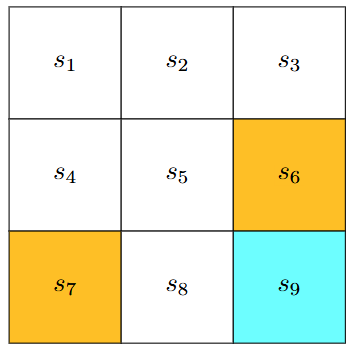
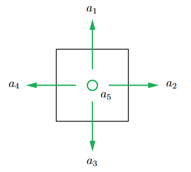
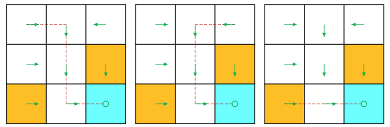
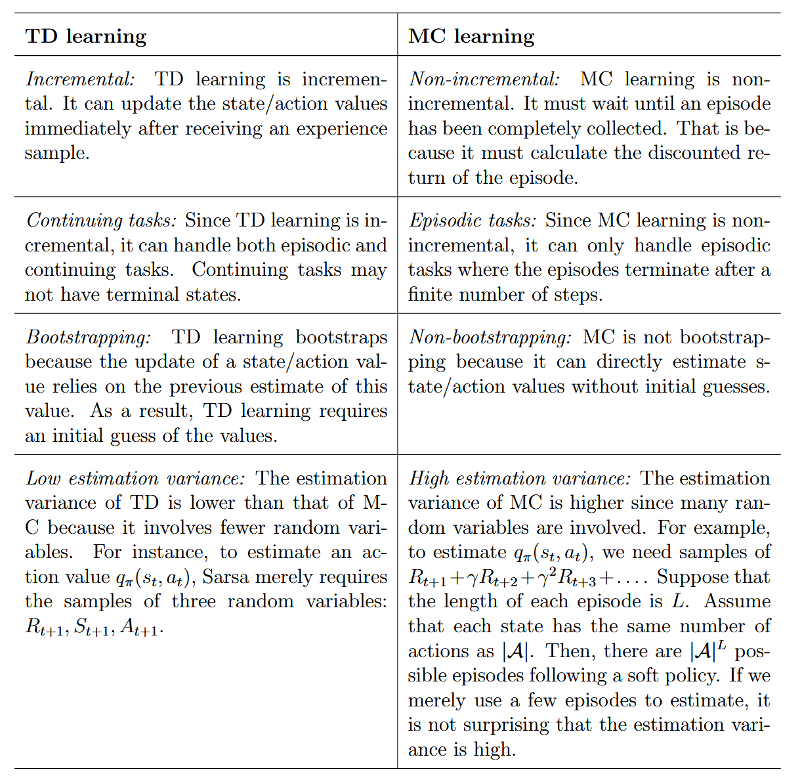

#### 1. 基础概念

- State：智能体相对于环境的状态，$s_1,\cdots,s_9$ 代表状态，其中$s_i = \{x_i,y_i\}$ 。
([Book-all-in-one](PDF/强化学习/Book-all-in-one.pdf#page=15&selection=43,0,48,1&color=note))
> The first concept to be introduced is the state, which describes the agent’s status with respect to the environment.
- State Space：将所有状态连接到一起得到状态空间，$S = \{s_1,\cdots,s_9\}$ 集合代表状态空间。
([Book-all-in-one](PDF/强化学习/Book-all-in-one.pdf#page=15&selection=63,29,78,1&color=note))
> The set of all the states is called the state space, denoted as S = {s1, . . . , s9}.

- Actions：每个状态智能体可能采取的行动，$a_1,\cdots,a_5$ 代表智能体在当前状态的行动。
> ([Book-all-in-one](PDF/强化学习/Book-all-in-one.pdf#page=15&selection=79,0,85,63&color=note))
> For each state, the agent can take five possible actions: moving upward, moving rightward, moving downward, moving leftward, and staying still.
- Action Spaces：将所有动作放在一起，$\mathcal{A} = \{a_1,\cdots,a_5\}$。
> ([Book-all-in-one](PDF/强化学习/Book-all-in-one.pdf#page=15&selection=94,37,111,1&color=note))
> he set of all actions is called the action space, denoted as A = {a1, . . . , a5}.

对于复杂样例，不能通过表格形式描述所有状态转移，此时引入条件概率进行描述：
$$
p (s_i|s_1,a_2)
$$
$s_1$采用行为$a_2$后到达各种状态的概率，其总和为1

- Policy：策略告诉智能体在每种状态采用的策略，如，告诉智能体$\pi(a_i|s1)$在$s_1$的状态下，采取$a_i$的概率是多少。
	1. deterministic policy：确定性策略，即在某个状态总是采用某个动作；
	2. Stochastic policy：随机性策略，在某个状态下选择的动作有概率不同；
> ([Book-all-in-one](PDF/强化学习/Book-all-in-one.pdf#page=17&selection=351,0,357,25&color=note))
> A policy tells the agent which actions to take at every state. 
- Reward：智能体执行一个行为到达一个状态时，会得到一个奖励值，正值为鼓励，负值为惩罚，即为$r(s,a)$ ，当然也可以反过来，正值为惩罚，负值为鼓励。
> ([Book-all-in-one](PDF/强化学习/Book-all-in-one.pdf#page=20&selection=9,0,25,73&color=note))
> The reward is a function of the state s and action a. Hence, it is also denoted as r(s, a). Its value can be a positive or negative real number or zero. 
- Trajectories：轨迹是一条状态动作奖励链
> ([Book-all-in-one](PDF/强化学习/Book-all-in-one.pdf#page=21&selection=297,0,301,30&color=note))
> A trajectory is a state-action-reward chain

$$s_1 \xrightarrow[a_2]{r=0} s_2 \xrightarrow[a_3]{r=0} s_5 \xrightarrow[a_3]{r=0} s_8 \xrightarrow[a_2]{r=1} s_9
$$
- Return：沿着一个trajectory的所有奖励加起来：$return = 0 + 0 + 0 + 1 = 1$
> ([Book-all-in-one](PDF/强化学习/Book-all-in-one.pdf#page=21&selection=360,0,365,10&color=note))
> The return of this trajectory is defined as the sum of all the rewards collected along the trajectory

由于当链无限长时回报会接近无穷，因此需要引入折扣回报：
- Discounted Return：折扣奖励之和。
$discounted \; return = r_1 + \gamma r_2 + \gamma^2 r_3 + \cdots$
其中$\gamma \in (0,1)$ 称为折扣率 
> ([Book-all-in-one](PDF/强化学习/Book-all-in-one.pdf#page=22&selection=238,38,239,19&color=note))
> In particular, the discounted return is the sum of the discounted rewards:
- episode（trial）：智能体在遵循策略与环境进行交互时，可能会在某些终止状态处停止。由此产生的轨迹被称为一个回合（或试验）。
如果实验在终止状态停止，称为episode tasks；否者称为continuing tasks。

将episode tasks 转化为 countinuing tasks：
- 策略1：将终点标记位特殊状态，让agent一致在终点位置“原地踏步”;
- 策略2：将终点状态当做一般状态，agent可能会跳出终点位置。
#### Markov decision processes(MDP)
> ([Book-all-in-one](PDF/强化学习/Book-all-in-one.pdf#page=24&selection=6,0,6,25&color=note))
> Markov decision processes

- Sets：
	- State space：$\mathcal{S}$
	- Action space：$\mathcal{A}(s)$其中$s \in \mathcal{S}$
	- Reward Set：$\mathcal{R}(s,a)$，其中$(s,a)$是状态行为对
- Model：
	- State transition probability：$p(s'|s,a)$，表示在状态`s`采取动作`a`后，转移到状态$s'$的概率。
	- Reward probability：$p(r|s,a)$，表示在状态`s`采取动作`a`后，获得奖励`r`的概率。
- Policy：$\pi(a|s)$
- Markov property：
$$
\begin{aligned}
p(s_{t+1}|s_{t},a_{t},s_{t-1},a_{t-1},\cdots,s_0,a_0) = p(s_{t+1}|s_{t},a_{t})
\\
p(r_{t+1}|s_{t},a_{t},s_{t-1},a_{t-1},\cdots,s_0,a_0) = p(r_{t+1}|s_{t},a_{t})
\end{aligned}
$$

#### 2. Bellman Equation
##### How to calculate returns

$$
\begin{aligned}
v1 = r1 + \gamma r_2 + \gamma^{2}r3 + \cdots \\ 
v2 = r2 + \gamma r_3 + \gamma^{2}r4 + \cdots \\

\end{aligned}
$$
可以转换为：
$$
\begin{aligned}
v_1 = r_1 + \gamma v_2 \\
v_2 = r_2 + \gamma v_3 
\end{aligned}
$$
写作矩阵形式：
$$
​​​\begin{equation*}
\underbrace{\begin{bmatrix} v_1 \\ v_2 \\ v_3 \\ v_4 \end{bmatrix}}_{v} = \begin{bmatrix} r_1 \\ r_2 \\ r_3 \\ r_4 \end{bmatrix} + \begin{bmatrix} \gamma v_2 \\ \gamma v_3 \\ \gamma v_4 \\ \gamma v_1 \end{bmatrix} = \underbrace{\begin{bmatrix} r_1 \\ r_2 \\ r_3 \\ r_4 \end{bmatrix}}_{r} + \gamma \underbrace{\begin{bmatrix} 0 & 1 & 0 & 0 \\ 0 & 0 & 1 & 0 \\ 0 & 0 & 0 & 1 \\ 1 & 0 & 0 & 0 \end{bmatrix}}_{P} \underbrace{\begin{bmatrix} v_1 \\ v_2 \\ v_3 \\ v_4 \end{bmatrix}}_{v}
\end{equation*}
$$
写作：$v = r + \gamma Pv$

State Value：当智能体遵循某个给定策略$\pi$时，从状态$s$能获得的期望回报（平均回报）状态值越大，说明从该状态出发，长期来看能获得的总奖励越多，对应的策略也就越好。因此，状态值是**评估和比较策略优劣的量化指标**。
$$v_{\pi}(s) \doteq \mathbb{E}[G_t \mid S_t = s]

$$
其中
$$
G_t \doteq R_{t+1} + \gamma R_{t+2} + \gamma^2 R_{t+3} + \dots,

$$
同return的区别：
- Return是单个trajectory的Reward和；
- State Value是多个trajectory的Reward分别的和的均值。
##### Bellman 公式
$$
\begin{aligned}
v_\pi(s) &= \mathbb{E}[R_{t+1}|S_t=s] + \gamma \mathbb{E}[G_{t+1}|S_t=s], \\
&= \sum_{a \in \mathcal{A}} \underbrace{\pi(a|s) \sum_{r \in \mathcal{R}} p(r|s, a)r}_{\text{mean of immediate rewards}} + \gamma \sum_{a \in \mathcal{A}} \underbrace{\pi(a|s) \sum_{s' \in \mathcal{S}} p(s'|s, a)v_\pi(s')}_{\text{mean of future rewards}}\\
&= \sum_{a \in \mathcal{A}} \pi(a|s) \left[ \sum_{r \in \mathcal{R}} p(r|s, a)r + \gamma \sum_{s' \in \mathcal{S}} p(s'|s, a)v_\pi(s') \right], \quad \text{for all } s \in \mathcal{S}.
\end{aligned}
$$
写成向量形式：
$$
v_{\pi} = r_{\pi} + \gamma P_{\pi}v_{\pi}
$$
展开（以只由四个状态为例）：
$$
\begin{equation*}
\underbrace{\begin{bmatrix}v_{\pi}(s_{1})\\v_{\pi}(s_{2})\\v_{\pi}(s_{3})\\v_{\pi}(s_{4})\end{bmatrix}}_{v_{\pi}} = \underbrace{\begin{bmatrix}r_{\pi}(s_{1})\\r_{\pi}(s_{2})\\r_{\pi}(s_{3})\\r_{\pi}(s_{4})\end{bmatrix}}_{r_{\pi}} + \gamma\underbrace{\begin{bmatrix}p_{\pi}(s_{1}|s_{1}) & p_{\pi}(s_{2}|s_{1}) & p_{\pi}(s_{3}|s_{1}) & p_{\pi}(s_{4}|s_{1}) \\ p_{\pi}(s_{1}|s_{2}) & p_{\pi}(s_{2}|s_{2}) & p_{\pi}(s_{3}|s_{2}) & p_{\pi}(s_{4}|s_{2}) \\ p_{\pi}(s_{1}|s_{3}) & p_{\pi}(s_{2}|s_{3}) & p_{\pi}(s_{3}|s_{3}) & p_{\pi}(s_{4}|s_{3}) \\ p_{\pi}(s_{1}|s_{4}) & p_{\pi}(s_{2}|s_{4}) & p_{\pi}(s_{3}|s_{4}) & p_{\pi}(s_{4}|s_{4})\end{bmatrix}}_{P_{\pi}}\underbrace{\begin{bmatrix}v_{\pi}(s_{1})\\v_{\pi}(s_{2})\\v_{\pi}(s_{3})\\v_{\pi}(s_{4})\end{bmatrix}}_{v_{\pi}}
\end{equation*}

$$
##### 从bellman公式求解state value
- 直接求逆：
$$v _ { \pi } = ( I - \gamma P _ { \pi } ) ^ { - 1 } r _ { \pi } .$$
- 迭代求解：
$$v _ { k + 1 } = r _ { \pi } + \gamma P _ { \pi } v _ { k } , \quad k = 0 , 1 , 2 , \ldots$$
这个算法可以生成$\{v_0,v_1,v_2,\cdots\}$，其中$v_0 \in \mathbb{R}^n$是$v_{\pi}$的一个猜测初值，当$k \rightarrow \infty$ 时：
$$v _ { k } \rightarrow v _ { \pi } = ( I - \gamma P _ { \pi } ) ^ { - 1 } r _ { \pi } , \quad { \mathrm { a s ~ } } k \rightarrow \infty .$$
其收敛于$v_{\pi}$
计算state value可以帮助我们判断策略是否好。
> [!PDF|note] [Book-all-in-one, p.28](PDF/强化学习/Book-all-in-one.pdf#page=41&selection=391,0,391,21&color=note)
> > Illustrative examples
> 

##### Action value
$$q _ { \pi } ( s , a ) \doteq \mathbb { E } [ G _ { t } | S _ { t } = s , A _ { t } = a ] .$$
其和State value关系：
$$
\begin{equation*}
\underbrace{\mathbb{E}[G_{t}|S_{t} = s]}_{v_{\pi}(s)} = \sum_{a \in \mathcal{A}} \underbrace{\mathbb{E}[G_{t}|S_{t} = s, A_{t} = a]}_{q_{\pi}(s,a)} \pi(a|s).
\end{equation*}
$$
化简为：
$$v _ { \pi } ( s ) = \sum _ { a \in { \mathcal { A } } } \pi ( a | s ) q _ { \pi } ( s , a ) .$$
由前面的公式可以得到：

$$
q_{\pi}(s, a) = \sum_{r \in \mathcal{R}} p(r|s, a)r + \gamma \sum_{s' \in \mathcal{S}} p(s'|s, a)v_{\pi}(s')
$$

#### 3. BOE（Bellman optimality equation）

最优策略$\pi^{*}$：如果一个策略$\pi^{*}$对所有状态$s \in \mathcal{S}$以及其他任何策略$\pi$，都满足$v_{\pi^{*}}(s) \geq v_{\pi}(s)$，测称$\pi^{*}$为最优策略。
最优状态值$v^{*}$：最优策略对应的状态值就是最优状态值。

$$
\begin{equation}
\begin{split}
v(s) &= \max_{\pi(s) \in \Pi(s)} \sum_{a \in \mathcal{A}} \pi(a|s) \left( \sum_{r \in \mathcal{R}} p(r|s, a)r + \gamma \sum_{s' \in \mathcal{S}} p(s'|s, a)v(s') \right) \\
&= \max_{\pi(s) \in \Pi(s)} \sum_{a \in \mathcal{A}} \pi(a|s)q(s, a),
\end{split}
\end{equation}

$$
矩阵写作：
$$
v = \max_{\pi \in \Pi}(r_{\pi} + \gamma P_{\pi}v),

$$
其中，$\pi$是选取最大的$q(s,a)$的action value。
当且仅当策略将所有概率赋予具有最大q值的动作时等号成立：
$$
v(s) = \begin{aligned} \max_{a \in \mathcal{A}}q(s,a) \end{aligned}
$$
这从数学上证明了：**最优策略必然是确定性的贪婪策略**，即在状态s下，以概率1选择动作值最大的动作$a^* = \arg\max_a q(s, a)$。

#### 4. Value Iteration and Policy Iteration
#####  Value Iteration
- Policy update：基于上轮$v_k$，寻求最大化期望回报策略$\pi_{k+1}$
$$
\pi_{k+1} = \begin{aligned} arg \max_{\pi}(r_{\pi} + \gamma P_{\pi}v_{k})\end{aligned}
$$

- value update：使用新策略$\pi_{k+1}$计算$v_{k+1}$
$$
v_{k+1} = r_{\pi_{k+1}} + \gamma P_{\pi_{k+1}}v_k
$$
#### Policy Iteration
- policy evaluation：计算当前策略$\pi_k$的真实状态值$v_{\pi_k}$：
$$
v_{\pi_k} = r_{\pi_k} + \gamma P_{\pi_k}v_{\pi_k}
$$
- policy improvement：基于计算出的精确状态$v_{\pi_k}$，生成新的策略$\pi_{k+1}$
$$
\pi_{k+1} = \begin{aligned} arg \max_{\pi}(r_{\pi} + \gamma P_{\pi}v_{\pi_k})\end{aligned}
$$

#### 5. Monte Carlo Methods
- 模型法：如果分布已知，可以直接计算；
- 采样法：如果分布未知，但是可以采集到独立同分布的样本${x_i}$，则可以通过计算样本均值来近似期望：
$$\mathrm { E } [ X ] \approx { \bar { x } } = { \frac { 1 } { n } } \sum _ { j = 1 } ^ { n } x _ { j } .$$
大数定律保证：当样本数量足够大时，期望均值会收敛于真实期望。
##### MC Basic
从(s,a)开始遵循策略$\pi_{k}$采样多个回合，用平均回报来近似动作值：
$$q _ { \pi _ { k } } ( s , a ) = \mathbb { E } [ G _ { t } | S _ { t } = s , A _ { t } = a ] \approx { \frac { 1 } { n } } \sum _ { i = 1 } ^ { n } { g _ { \pi _ { k } } ^ { ( i ) } ( s , a ) } .$$
局限：MC Basic 要求**探索性起始**，即每个状态-动作(s,a)
都必须被作为回合的起点充分探索。这在许多实际应用（如机器人控制）中是不可能实现的。此外，它的样本效率极低。
##### MC ε-Greedy
不在使用纯贪心策略，强制策略以概率 $\epsilon$ 随机探索其他动作：
$$
\begin{equation*}
    \pi _ { k + 1 } ( a | s ) = \left\{ \begin{array} { c c } { { 1 - \frac { | \mathcal { A } ( s ) | - 1 } { | \mathcal { A } ( s ) | } \epsilon , } } & { { a = a _ { k } ^ { * } , } } \\ { { \frac { 1 } { | \mathcal { A } ( s ) | } \epsilon , } } & { { a \neq a _ { k } ^ { * } , } } \end{array} \right.
\end{equation*}

$$
其中$a _ { k } ^ { * } = \arg \operatorname* { m a x } _ { a } q _ { \pi _ { k } } ( s , a )$ 是当前最优动作。

#### 6. Stochastic Approximation（随机迭代算法去解决找到优化问题都为SA）
估计随机变量$X$期望的方法
- 非增强方法：收集所有样本$\{x_i\}^{n}_{i=1}$后，一次性计算样本均值；
- 增量方法：
$$w _ { k + 1 } = w _ { k } - { \frac { 1 } { k } } ( w _ { k } - x _ { k } )$$
其中$w_k$是第$k$步估计值，这样就能逐步计算样本均值 

##### Robbins-Monro Algorithm
求解$g(w) = 0$的根，但不需要知道函数g具体形式或其导数，主要要给定w时，观测到一个带有噪音的函数值$\tilde g(w,\eta)$ 。
$$w _ { k + 1 } = w _ { k } - a _ { k } { \tilde { g } } ( w _ { k } , \eta _ { k } ) , \quad k = 1 , 2 , 3 , \ldots$$
其中$a_k > 0$是步长，$\tilde g(w_k,\eta_k) = g(w_k) + \eta_k$是对真实梯度$g(w_k)$的有噪观测。

RM算法收敛条件：
- 梯度条件：
$$0 < c _ { 1 } \leq \nabla _ { w } g ( w ) \leq c _ { 2 }$$
要求$g(w)$的梯度为正，且有界；
- 步长条件：
$$
\sum_{k=1}^{\infty} a_{k}=\infty \text { 且 } \sum_{k=1}^{\infty} a_{k}^{2}<\infty
$$
左边条件保证步长不能衰弱太快，右边条件保证$a_k$收敛于0
- 噪声条件：
$$
\mathbb{E}[\eta_k | \mathcal{H}_k] = 0 \text{ 且 } \mathbb{E}[\eta_k^2 | \mathcal{H}_k] < \infty
$$
左边条件保证噪声长期来看是中性的，不会引入系统性偏差。
右边条件保证噪声的波动受限的，不会出现无限大极端干扰。

##### Stochastic Gradient Descent
目标是最小化$\min _ { w } J ( w ) = \mathbb { E } [ f ( w , X ) ] ,$ 其中$w$是需要优化参数，$X$是随机变量，$f(w,X)$是损失函数；
理想情况，计算真实梯度，然后沿负梯度方向更新：
$$w _ { k + 1 } = w _ { k } - \alpha _ { k } \nabla _ { w } J ( w _ { k } ) = w _ { k } - \alpha _ { k } \mathbb { E } [ \nabla _ { w } f ( w _ { k } , X ) ] .$$
真实情况，我们不知道数据的真实分布，需要拿到一批采样数据。
BGD：采样完n次在计算：
$$
\begin{equation*}
    \mathbb{E}[\nabla_w f(w_k, X)] \approx \frac{1}{n} \sum_{i=1}^n \nabla_w f(w_k, x_i).
\end{equation*}
$$
$$w _ { k + 1 } = w _ { k } - { \frac { \alpha _ { k } } { n } } \sum _ { i = 1 } ^ { n } \nabla _ { w } f ( w _ { k } , x _ { i } ) .$$
现在让n = 1得到SGD算法：
$$
w _ { k + 1 } = w _ { k } - \alpha _ { k } \nabla _ { w } f ( w _ { k } , x _ { k } ) ,
$$

SGD是特殊的RM算法，因此只要满足RM算法的条件，其一定收敛。

MBGD：一批小样本（1 < batch < 全部)
$$
w _ { k + 1 } = w _ { k } - \alpha _ { k } { \frac { 1 } { m } } \sum _ { j \in { \mathcal { I } } _ { k } } \nabla _ { w } f ( w _ { k } , x _ { j } ) ,
$$
MBGD batch == 1 时 == SGD，
MBGD batch == n 时 ≠ BGD，≈ BGD，因为BGD是所有采用，MBGD是随机采样。

#### 7. Temporal-Difference Learning
给定策略$\pi$，我们的目标是估计$v_{\pi}(s)$对所有的状态空间，我们通过$\pi$采样得到$(s_0,r_1,s_1 ,\cdots, s_t,r_{t+1},s_{t+1})$，TD算法利用这些样本估计计算状态值：
$$\begin{align*}
v _ { t + 1 } ( s _ { t } ) & = v _ { t } ( s _ { t } ) - \alpha _ { t } ( s _ { t } ) \left[ v _ { t } ( s _ { t } ) - \left( r _ { t + 1 } + \gamma v _ { t } ( s _ { t + 1 } ) \right) \right] , \\
v _ { t + 1 } ( s ) & = v _ { t } ( s ) , \quad \text { for all } s \neq s _ { t } ,
\end{align*}
$$
我们式子做一下标记：
$$\underbrace { v _ { t + 1 } ( s _ { t } ) } _ { \text {new estimate } } = \underbrace { v _ { t } ( s _ { t } ) } _ { \text {current estimate } } - \alpha _ { t } ( s _ { t } ) \left[ \overbrace { v _ { t } ( s _ { t } ) - \underbrace { \left( r _ { t + 1 } + \gamma v _ { t } ( s _ { t + 1 } ) \right) } _ { \text {TD target } \bar { v } _ { t } } } ^ { \text {TD error }  \delta _ { t } } \right] ,
$$
其中：
$$\bar{v}_t \doteq r_{t+1} + \gamma v_t(s_{t+1})
$$
这里的$\bar v_t$为TD target，$\delta_t$为TD error
为什么叫target和error，因为$v_{t+1}(s_t)$ 总是比$v_t(s_t)$更接近$\bar v_t$，$\delta_t$能说明$v_t$
和$v_{\pi}$之间的差距。

与蒙特卡洛方法对比：

##### Sarsa
给定策略$\pi$，我们的目标是对动作价值进行估计，假设我们拥有按照策略$\pi$生成的若干经验样本：$(s_0,a_0,r_1,s_1,a_1,\cdots,s_t,a_t,r_{t+1},s_{t+1},a_{t+1}$我们可以采用下述Sarsa算法对动作价值进行采样：
$$\begin{align*}
q _ { t + 1 } ( s _ { t } , a _ { t } ) & = q _ { t } ( s _ { t } , a _ { t } ) - \alpha _ { t } ( s _ { t } , a _ { t } ) \left[ q _ { t } ( s _ { t } , a _ { t } ) - \left( r _ { t + 1 } + \gamma q _ { t } ( s _ { t + 1 } , a _ { t + 1 } ) \right) \right] , \\
q _ { t + 1 } ( s , a ) & = q _ { t } ( s , a ) , \quad \text { for all } ( s , a ) \neq ( s _ { t } , a _ { t } ) ,
\end{align*}
$$
此处$q_t(s_t,a_t)$是对$q_\pi(s_t,a_t)$的估计值。
