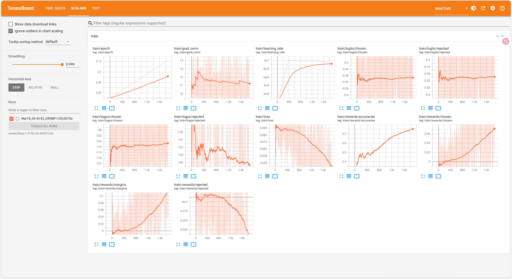
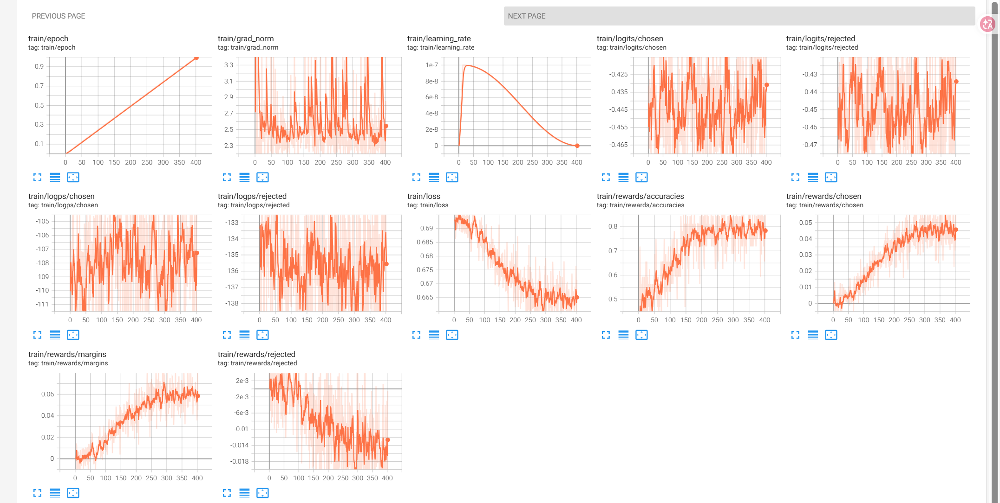

# 关键代码

## 数据处理代码
```python
import json

import os

  

def transform_for_llama_factory(input_file_path, output_file_path):

    """

    转换数据为LLaMA-Factory多模态DPO训练格式（解决<image> token和图片数量不匹配问题）

    参数:

        input_file_path: 原始JSON文件路径

        output_file_path: 转换后保存路径

    """

    # 检查输入文件

    if not os.path.exists(input_file_path):

        raise FileNotFoundError(f"输入文件不存在：{input_file_path}")

    # 读取并转换数据

    with open(input_file_path, 'r', encoding='utf-8') as f:

        original_data = json.load(f)

    transformed_data = []

    for idx, item in enumerate(original_data):

        try:

            image_path = item.get("image")

            if not image_path:

                print(f"警告：第{idx}条数据无图片路径，跳过")

                continue

            # 提取human对话（包含<image> token）

            human_conv = [conv for conv in item["conversations"] if conv["from"] == "human"]

            if not human_conv:

                print(f"警告：第{idx}条数据无human对话，跳过")

                continue

            # 提取chosen/rejected的gpt回复

            chosen_conv = [conv for conv in item["conversations"] if conv["from"] == "gpt"]

            rejected_conv = [conv for conv in item["rejected_conversations"] if conv["from"] == "gpt"]

            if not chosen_conv or not rejected_conv:

                print(f"警告：第{idx}条数据缺少chosen/rejected回复，跳过")

                continue

            # 构建LLaMA-Factory兼容的多模态DPO格式

            transformed_item = {

                "image": image_path,

                "conversations": human_conv,

                "chosen": chosen_conv[0],

                "rejected": rejected_conv[0]

            }

            transformed_data.append(transformed_item)

        except Exception as e:

            print(f"警告：第{idx}条数据转换失败，错误：{str(e)}，跳过")

            continue

    # 写入转换后的数据

    with open(output_file_path, 'w', encoding='utf-8') as f:

        json.dump(transformed_data, f, ensure_ascii=False, indent=2)

    print(f"转换完成！原始数据{len(original_data)}条，有效转换{len(transformed_data)}条")

    print(f"输出文件：{output_file_path}")

  

# ====================== 配置路径======================

INPUT_JSON_PATH = "./LLaVA_1.5_7b_1iteration.json"

OUTPUT_JSON_PATH = "./Transformed_LLaVA_1.5_7b_1iteration.json"

  

# ====================== 执行转换 ======================

if __name__ == "__main__":

    try:

        transform_for_llama_factory(INPUT_JSON_PATH, OUTPUT_JSON_PATH)

        print("✅ 数据转换完成，可用于LLaMA-Factory多模态DPO训练")

    except Exception as e:

        print(f"❌ 转换失败：{str(e)}")
```

## 评估代码
```python

```

## LlamaFactory训练配置文件
```yaml
# 模型基础配置

model_name_or_path: llava-hf/llava-1.5-7b-hf

trust_remote_code: true

template: llava  # 必须指定llava对话模板

  

# 数据配置

dataset: csr_iter0  # 先用iter0训练，后续迭代更换为csr_iter1/csr_iter2

cutoff_len: 1024

preprocessing_num_workers: 1

# 训练类型

stage: dpo  # DPO偏好优化

do_train: true

finetuning_type: lora  # LoRA微调，大幅节省显存

lora_target: q_proj,v_proj,k_proj,o_proj,gate_proj,up_proj,down_proj  # 微调所有线性层，效果最优

lora_rank: 128

lora_alpha: 256

lora_dropout: 0.05

  

# 训练超参数

output_dir: saves/llava-1.5-7b-csr-iter0

per_device_train_batch_size: 1

gradient_accumulation_steps: 1

learning_rate: 1e-7

warmup_ratio: 0.03

num_train_epochs: 1

lr_scheduler_type: cosine

bf16: true

tf32: true

gradient_checkpointing: true  # 大幅节省显存

flash_attn: fa2

  

# TensorBoard日志配置

logging_steps: 1

save_strategy: steps

save_steps: 100

save_total_limit: 1

report_to: tensorboard
```
## POPE评估结果

### 训练前

### 训练后

# 成功运行截图

## 数据处理

  

## 训练


## POPE评估

### VLLM成功部署
	
  

### 成功请求

  

  

# 遇到的困难以及解决方法

- 1.flash-attn 在windows端和linux端需要找到对应的PyTorch和Python版本；
- 2.数据集COCO国内服务器下载太慢，去租了一个国外的服务器；
- 3.为了方便操作，配置了vscode SSH Remote 插件，但是安装不上.vscode_server在服务器，需要手动下载；
- 4.用国外服务器scp 文件后有问题（具体来说是本地windows能跑，scp过去后跑不了，应该是服务器编码等因素，包括zip文件传过去也是有问题的，暂时方法是在服务器内下载）。