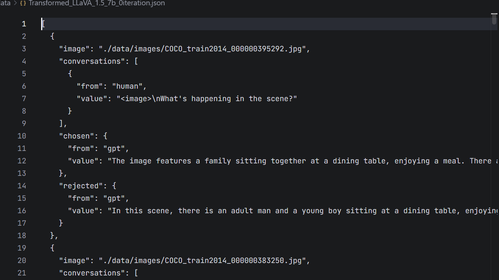
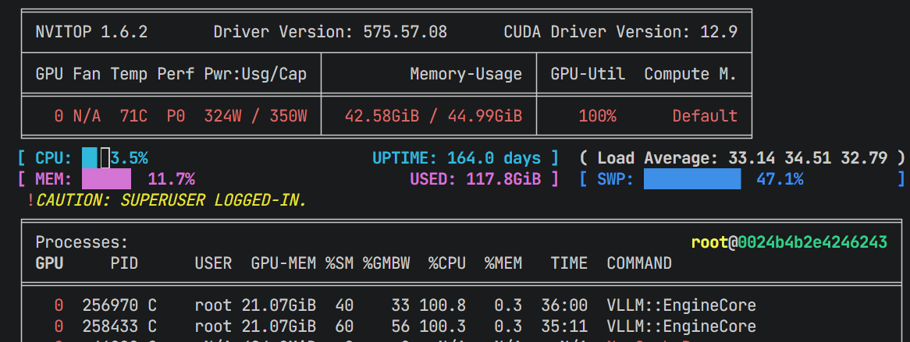
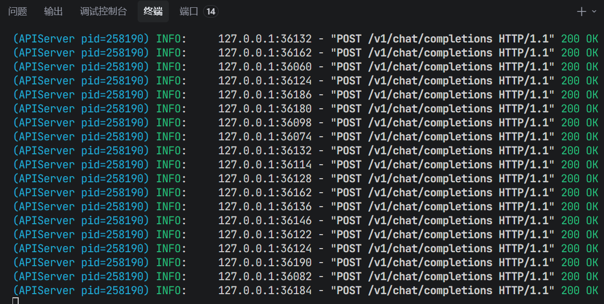

# 关键代码

## 数据处理代码
```python
import json

import os

  

def transform_for_llama_factory(input_file_path, output_file_path):

    """

    转换数据为LLaMA-Factory多模态DPO训练格式（解决<image> token和图片数量不匹配问题）

    参数:

        input_file_path: 原始JSON文件路径

        output_file_path: 转换后保存路径

    """

    # 检查输入文件

    if not os.path.exists(input_file_path):

        raise FileNotFoundError(f"输入文件不存在：{input_file_path}")

    # 读取并转换数据

    with open(input_file_path, 'r', encoding='utf-8') as f:

        original_data = json.load(f)

    transformed_data = []

    for idx, item in enumerate(original_data):

        try:

            image_path = item.get("image")

            if not image_path:

                print(f"警告：第{idx}条数据无图片路径，跳过")

                continue

            # 提取human对话（包含<image> token）

            human_conv = [conv for conv in item["conversations"] if conv["from"] == "human"]

            if not human_conv:

                print(f"警告：第{idx}条数据无human对话，跳过")

                continue

            # 提取chosen/rejected的gpt回复

            chosen_conv = [conv for conv in item["conversations"] if conv["from"] == "gpt"]

            rejected_conv = [conv for conv in item["rejected_conversations"] if conv["from"] == "gpt"]

            if not chosen_conv or not rejected_conv:

                print(f"警告：第{idx}条数据缺少chosen/rejected回复，跳过")

                continue

            # 构建LLaMA-Factory兼容的多模态DPO格式

            transformed_item = {

                "image": image_path,

                "conversations": human_conv,

                "chosen": chosen_conv[0],

                "rejected": rejected_conv[0]

            }

            transformed_data.append(transformed_item)

        except Exception as e:

            print(f"警告：第{idx}条数据转换失败，错误：{str(e)}，跳过")

            continue

    # 写入转换后的数据

    with open(output_file_path, 'w', encoding='utf-8') as f:

        json.dump(transformed_data, f, ensure_ascii=False, indent=2)

    print(f"转换完成！原始数据{len(original_data)}条，有效转换{len(transformed_data)}条")

    print(f"输出文件：{output_file_path}")

  

# ====================== 配置路径======================

INPUT_JSON_PATH = "./LLaVA_1.5_7b_1iteration.json"

OUTPUT_JSON_PATH = "./Transformed_LLaVA_1.5_7b_1iteration.json"

  

# ====================== 执行转换 ======================

if __name__ == "__main__":

    try:

        transform_for_llama_factory(INPUT_JSON_PATH, OUTPUT_JSON_PATH)

        print("✅ 数据转换完成，可用于LLaMA-Factory多模态DPO训练")

    except Exception as e:

        print(f"❌ 转换失败：{str(e)}")
```

## 评估代码
```python
import asyncio

from datasets import load_dataset

from openai import AsyncOpenAI

import base64

import os

from typing import List, Dict

import time

  

class PopeEvaluator:

    """Class for Evaluating MLLMs on POPE dataset."""

    def __init__(self, *args, **kwargs):

        pass

    def evaluate(self, records: List[Dict]) -> Dict:

        """Evaluate the records and return metrics."""

        metrics = {

            key: {

                "tp": 0, "tn": 0, "fp": 0, "fn": 0,

                "count": 0, "accuracy": 0.0,

                "precision": 0.0, "recall": 0.0, "f1": 0.0,

            }

            for key in ["random", "popular", "adversarial", "overall"]

        }

        for record in records:

            answer = record["answer"].strip().lower()

            response = record["response"].strip().lower()

            category = record["category"]

            # 鲁棒的标签判断（适配不同的回答格式）

            ans_pos = 1 if answer == "yes" else 0

            # 处理否定词：no/not/n't/否/不是/没有 等

            neg_words = {"no", "not", "n't", "否", "不是", "没有"}

            resp_pos = 0 if any(word in response for word in neg_words) else 1

            # 更新分类指标

            metrics[category]["tp"] += ans_pos * resp_pos

            metrics[category]["tn"] += (1 - ans_pos) * (1 - resp_pos)

            metrics[category]["fp"] += (1 - ans_pos) * resp_pos

            metrics[category]["fn"] += ans_pos * (1 - resp_pos)

            metrics[category]["count"] += 1

            # 更新整体指标

            metrics["overall"]["tp"] += ans_pos * resp_pos

            metrics["overall"]["tn"] += (1 - ans_pos) * (1 - resp_pos)

            metrics["overall"]["fp"] += (1 - ans_pos) * resp_pos

            metrics["overall"]["fn"] += ans_pos * (1 - resp_pos)

            metrics["overall"]["count"] += 1

        # 计算最终指标

        for cat in metrics:

            count = metrics[cat]["count"]

            if count == 0:

                continue

            tp, tn, fp, fn = (metrics[cat]["tp"], metrics[cat]["tn"],

                             metrics[cat]["fp"], metrics[cat]["fn"])

            metrics[cat]["accuracy"] = (tp + tn) / count

            metrics[cat]["precision"] = tp / (tp + fp) if (tp + fp) > 0 else 0.0

            metrics[cat]["recall"] = tp / (tp + fn) if (tp + fn) > 0 else 0.0

            metrics[cat]["f1"] = 2 * metrics[cat]["precision"] * metrics[cat]["recall"] / (

                metrics[cat]["precision"] + metrics[cat]["recall"]

            ) if (metrics[cat]["precision"] + metrics[cat]["recall"]) > 0 else 0.0

        return metrics

  

async def get_model_response(client: AsyncOpenAI, model_name: str, content: list):

    """封装模型请求，统一错误处理"""

    try:

        response = await client.chat.completions.create(

            model=model_name,

            messages=[{"role": "user", "content": content}],

            max_tokens=100,

            temperature=0.0,

            timeout=120

        )

        return response.choices[0].message.content.strip()

    except Exception as e:

        print(f"Model request error: {str(e)[:100]}")

        return ""

  

async def process_sample(sample: dict, coco_dir: str, base_client: AsyncOpenAI,

                        trained_client: AsyncOpenAI, base_model_name: str,

                        trained_model_name: str, semaphore: asyncio.Semaphore):

    """并行处理单个样本，同时请求两个模型（带并发限制，支持不同模型名）"""

    async with semaphore:

        # 基础字段提取

        question = sample["question"]

        answer = sample["answer"]

        category = sample["category"]

        image_source = sample["image_source"]

  

        # 直接用image_source生成文件名，和本地COCO图片完全匹配

        image_filename = f"{image_source}.jpg"

        # 校验图片路径

        image_path = os.path.join(coco_dir, image_filename)

        if not os.path.exists(image_path):

            print(f"Image not found: {image_path}")

            return None, None

  

        # 编码图片为base64

        with open(image_path, "rb") as f:

            base64_image = base64.b64encode(f.read()).decode("utf-8")

        content = [

            {"type": "text", "text": question},

            {"type": "image_url", "image_url": {"url": f"data:image/jpeg;base64,{base64_image}"}}

        ]

  

        # 并行请求两个模型（分别传入对应的模型名）

        base_resp, trained_resp = await asyncio.gather(

            get_model_response(base_client, base_model_name, content),

            get_model_response(trained_client, trained_model_name, content)

        )

  

        # 构造评估记录

        base_record = {"answer": answer, "response": base_resp, "category": category}

        trained_record = {"answer": answer, "response": trained_resp, "category": category}

        return base_record, trained_record

  

def print_metrics_table(base_metrics: Dict, trained_metrics: Dict):

    """打印美观的横向对比表格，含提升幅度Δ"""

    # ANSI颜色代码

    GREEN = "\033[92m"

    RED = "\033[91m"

    RESET = "\033[0m"

    BOLD = "\033[1m"

    # 表格标题

    print("\n" + "="*120)

    print(f"{BOLD}📊 POPE 模型对比评估结果{RESET}".center(120))

    print("="*120)

    # 表头

    header = (

        f"| {'Category':<12} | {'Model':<10} | {'Accuracy':<10} | {'Precision':<10} | {'Recall':<10} | {'F1':<10} |"

    )

    print(header)

    print("|" + "-"*14 + "|" + "-"*12 + "|" + "-"*12 + "|" + "-"*12 + "|" + "-"*12 + "|" + "-"*12 + "|")

    # 按顺序处理所有类别

    categories = ["random", "popular", "adversarial", "overall"]

    for cat in categories:

        base_m = base_metrics.get(cat, {})

        trained_m = trained_metrics.get(cat, {})

        # 跳过无数据的类别

        if base_m.get("count", 0) == 0 or trained_m.get("count", 0) == 0:

            continue

        # 打印Base模型行

        print(

            f"| {cat.upper():<12} | {'Base':<10} | "

            f"{base_m['accuracy']:.4f}{'':<6} | "

            f"{base_m['precision']:.4f}{'':<6} | "

            f"{base_m['recall']:.4f}{'':<6} | "

            f"{base_m['f1']:.4f}{'':<6} |"

        )

        # 计算提升幅度Δ

        def format_delta(base_val, trained_val):

            delta = trained_val - base_val

            if delta > 0:

                return f"{trained_val:.4f} {GREEN}(+{delta:.4f}){RESET}"

            elif delta < 0:

                return f"{trained_val:.4f} {RED}({delta:.4f}){RESET}"

            else:

                return f"{trained_val:.4f} ( - )"

        # 打印Trained模型行（含Δ）

        print(

            f"| {'':<12} | {'Trained':<10} | "

            f"{format_delta(base_m['accuracy'], trained_m['accuracy']):<18} | "

            f"{format_delta(base_m['precision'], trained_m['precision']):<18} | "

            f"{format_delta(base_m['recall'], trained_m['recall']):<18} | "

            f"{format_delta(base_m['f1'], trained_m['f1']):<18} |"

        )

        # 类别间分隔线

        if cat != categories[-1]:

            print("|" + "-"*14 + "|" + "-"*12 + "|" + "-"*12 + "|" + "-"*12 + "|" + "-"*12 + "|" + "-"*12 + "|")

    print("="*120 + "\n")

  

async def main():

    import argparse

    parser = argparse.ArgumentParser()

    parser.add_argument("--coco-dir", type=str, required=True,

                        help="Path to COCO val2014 images directory (e.g., ./data/coco2014_val)")

    parser.add_argument("--base-model-url", type=str, default="http://localhost:8000/v1")

    parser.add_argument("--trained-model-url", type=str, default="http://localhost:8001/v1")

    # 关键修改：新增分别指定Base和Trained模型名的参数

    parser.add_argument("--base-model-name", type=str, required=True,

                        help="Model name for base model (from curl /v1/models)")

    parser.add_argument("--trained-model-name", type=str, required=True,

                        help="Model name for trained model (from curl /v1/models)")

    parser.add_argument("--limit", type=int, default=None, help="Limit number of samples (for test)")

    parser.add_argument("--max-concurrent", type=int, default=20, help="Max concurrent requests")

    args = parser.parse_args()

  

    # 初始化OpenAI客户端

    base_client = AsyncOpenAI(base_url=args.base_model_url, api_key="dummy")

    trained_client = AsyncOpenAI(base_url=args.trained_model_url, api_key="dummy")

  

    # 加载POPE数据集

    print("Loading POPE dataset...")

    dataset = load_dataset("lmms-lab/POPE", split="test")

    # 打印数据集字段和第一个样本的文件名，提前验证匹配

    if len(dataset) > 0:

        first_sample = dataset[0]

        print(f"Dataset loaded successfully, sample fields: {list(first_sample.keys())}")

        print(f"First sample expected filename: {first_sample['image_source']}.jpg")

    # 测试时限制样本数

    if args.limit:

        dataset = dataset.select(range(args.limit))

  

    # 构造任务（带并发限制）

    base_records = []

    trained_records = []

    tasks = []

    semaphore = asyncio.Semaphore(args.max_concurrent)

    for sample in dataset:

        task = process_sample(sample, args.coco_dir, base_client, trained_client,

                            args.base_model_name, args.trained_model_name, semaphore)

        tasks.append(task)

  

    # 执行所有任务

    print(f"Start processing {len(tasks)} samples...")

    start_time = time.time()

    results = await asyncio.gather(*tasks)

    end_time = time.time()

  

    # 整理有效结果

    valid_count = 0

    for base_rec, trained_rec in results:

        if base_rec and trained_rec:

            base_records.append(base_rec)

            trained_records.append(trained_rec)

            valid_count += 1

    print(f"Valid samples processed: {valid_count}/{len(tasks)}")

  

    # 执行评估

    evaluator = PopeEvaluator()

    base_metrics = evaluator.evaluate(base_records)

    trained_metrics = evaluator.evaluate(trained_records)

  

    # 打印美观的对比表格

    print_metrics_table(base_metrics, trained_metrics)

  

    print(f"Total processing time: {end_time - start_time:.2f} seconds")

  

if __name__ == "__main__":

    # 跨平台异步兼容

    if os.name == 'nt':

        asyncio.set_event_loop_policy(asyncio.WindowsSelectorEventLoopPolicy())

    asyncio.run(main())
```

## LlamaFactory训练配置文件
```yaml
# 模型基础配置

model_name_or_path: "./models/llava-1.5-7b-hf"

trust_remote_code: true

template: llava  # 必须指定llava对话模板

  

# 数据配置

dataset: csr_iter0  # 先用iter0训练，后续迭代更换为csr_iter1/csr_iter2

cutoff_len: 1024

preprocessing_num_workers: 1

  

# 训练类型

stage: dpo  # DPO偏好优化

do_train: true

finetuning_type: lora  # LoRA微调，大幅节省显存

lora_target: q_proj,v_proj,k_proj,o_proj,gate_proj,up_proj,down_proj  # 微调所有线性层，效果最优

lora_rank: 128

lora_alpha: 256

lora_dropout: 0.05

  

# 训练超参数

output_dir: saves/llava-1.5-7b-csr-iter0

per_device_train_batch_size: 8

gradient_accumulation_steps: 4

learning_rate: 1e-7

warmup_ratio: 0.03

num_train_epochs: 1

lr_scheduler_type: cosine

bf16: true

tf32: true

gradient_checkpointing: false

flash_attn: fa2

deepspeed : './examples/deepspeed/ds_z2_config.json'

# TensorBoard日志配置

logging_steps: 1

save_strategy: steps

save_steps: 100

save_total_limit: 1

report_to: tensorboard
```
## POPE评估结果

### 训练前
========================================================================================================================
                                                📊 POPE 模型对比评估结果                                                 
========================================================================================================================
| Category     | Model      | Accuracy   | Precision  | Recall     | F1         |
|--------------|------------|------------|------------|------------|------------|
| RANDOM       | Base       | 0.8727       | 0.8803       | 0.8627       | 0.8714       |
|              | Trained    | 0.8740 (+0.0013) | 0.8827 (+0.0024) | 0.8627 ( - )       | 0.8726 (+0.0012) |
|--------------|------------|------------|------------|------------|------------|
| POPULAR      | Base       | 0.8323       | 0.8133       | 0.8627       | 0.8373       |
|              | Trained    | 0.8340 (+0.0017) | 0.8159 (+0.0026) | 0.8627 ( - )       | 0.8386 (+0.0014) |
|--------------|------------|------------|------------|------------|------------|
| ADVERSARIAL  | Base       | 0.7660       | 0.7237       | 0.8607       | 0.7862       |
|              | Trained    | 0.7683 (+0.0023) | 0.7265 (+0.0029) | 0.8607 ( - )       | 0.7879 (+0.0017) |
|--------------|------------|------------|------------|------------|------------|
| OVERALL      | Base       | 0.8237       | 0.8006       | 0.8620       | 0.8302       |
|              | Trained    | 0.8254 (+0.0018) | 0.8033 (+0.0027) | 0.8620 ( - )       | 0.8316 (+0.0014) |
========================================================================================================================

### 训练后
========================================================================================================================
                                                📊 POPE 模型对比评估结果                                                 
========================================================================================================================
| Category     | Model      | Accuracy   | Precision  | Recall     | F1         |
|--------------|------------|------------|------------|------------|------------|
| RANDOM       | Base       | 0.8727       | 0.8803       | 0.8627       | 0.8714       |
|              | Trained    | 0.8740 (+0.0013) | 0.8827 (+0.0024) | 0.8627 ( - )       | 0.8726 (+0.0012) |
|--------------|------------|------------|------------|------------|------------|
| POPULAR      | Base       | 0.8323       | 0.8133       | 0.8627       | 0.8373       |
|              | Trained    | 0.8340 (+0.0017) | 0.8159 (+0.0026) | 0.8627 ( - )       | 0.8386 (+0.0014) |
|--------------|------------|------------|------------|------------|------------|
| ADVERSARIAL  | Base       | 0.7660       | 0.7237       | 0.8607       | 0.7862       |
|              | Trained    | 0.7683 (+0.0023) | 0.7265 (+0.0029) | 0.8607 ( - )       | 0.7879 (+0.0017) |
|--------------|------------|------------|------------|------------|------------|
| OVERALL      | Base       | 0.8237       | 0.8006       | 0.8620       | 0.8302       |
|              | Trained    | 0.8254 (+0.0018) | 0.8033 (+0.0027) | 0.8620 ( - )       | 0.8316 (+0.0014) |
========================================================================================================================


# 成功运行截图

## 数据处理

## 训练

## POPE评估

### VLLM成功部署

### 成功请求

# 遇到的困难以及解决方法

- 1.flash-attn 在windows端和linux端需要找到对应的PyTorch和Python版本；
- 2.数据集COCO国内服务器下载太慢，去租了一个国外的服务器；
- 3.为了方便操作，配置了vscode SSH Remote 插件，但是安装不上.vscode_server在服务器，需要手动下载；
- 4.用国外服务器scp 文件后有问题（具体来说是本地windows能跑，scp过去后跑不了，应该是服务器编码等因素，包括zip文件传过去也是有问题的，暂时方法是在服务器内下载）；
- uv 配置vllm pytorch cuda flash-attn需要着重考虑，是一个费时间的点。
