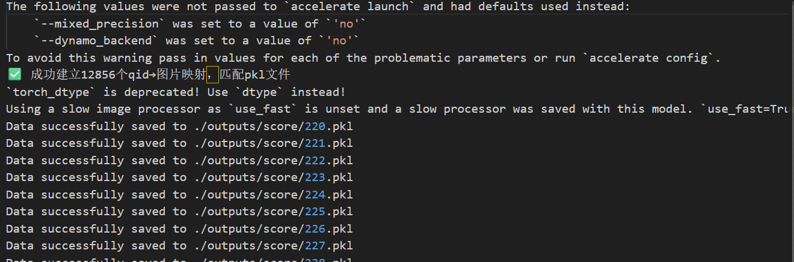

# 关键代码
## CSR的数据集生成(用vllm部署模型 + openai 库调用)
##### sample.py
```python
from utils import *
import torch
from vllm import LLM, SamplingParams
from PIL import Image
import os
import argparse
import json
import time
import warnings
import logging

# 关闭所有冗余日志/警告
warnings.filterwarnings("ignore")
logging.getLogger("vllm").setLevel(logging.ERROR)
os.environ["VLLM_LOG_LEVEL"] = "ERROR"

DEFAULT_IMAGE_TOKEN = "<image>"

def get_prompts(inputs):
    input_questions = [DEFAULT_IMAGE_TOKEN + '\n' + input_question for input_question in inputs]
    prompts = []
    for input_q in input_questions:
        conv = conv_templates['v1'].copy()
        conv.append_message(conv.roles[0], input_q)
        conv.append_message(conv.roles[1], None)
        prompts.append(conv.get_prompt())
    return prompts

def calculate_sequence_logprob(completion):
    total_logprob = 0.0
    for token_logprob_dict in completion.logprobs:
        if token_logprob_dict:
            logprob_obj = next(iter(token_logprob_dict.values()))
            try:
                total_logprob += logprob_obj.logprob
            except AttributeError:
                total_logprob += float(logprob_obj)
    return total_logprob

# ====================== Beam 树核心逻辑 ======================
def sentence_level_beam_search_tree(qid, llm, tokenizer, initial_text, image, sentence_end_id, max_length, max_new_tokens, num_beams, num_beam_group, token_level_beams, diversity_penalty):
    root = Node(initial_text, 0, 0)
    active_nodes = [root]

    while active_nodes:
        new_nodes = []
        for node in active_nodes:
            current_prompt = node.text
            multimodal_prompt = {
                "prompt": current_prompt,
                "multi_modal_data": {"image": image}
            }
            sampling_params = SamplingParams(
                n=token_level_beams,
                stop_token_ids=[sentence_end_id],
                max_tokens=max_new_tokens,
                logprobs=1,
                temperature=0.5
            )
            outputs = llm.generate(prompts=multimodal_prompt, sampling_params=sampling_params)

            for output in outputs:
                for completion in output.outputs:
                    gen_text = completion.text
                    full_text = node.text + gen_text
                    total_logprob = calculate_sequence_logprob(completion)
                    new_score = node.score + total_logprob
                    is_final = (sentence_end_id in completion.token_ids) or (len(full_text) >= max_length)
                    new_node = Node(full_text, new_score, node.depth + 1, node, is_final)
                    node.add_child(new_node)
                    if not is_final:
                        new_nodes.append(new_node)

        new_nodes.sort(key=lambda x: x.score, reverse=True)
        active_nodes = new_nodes[:int(num_beams/2)-1] + new_nodes[-int(num_beams/2):] if len(new_nodes) >= num_beams else new_nodes
        if not active_nodes:
            break
    return [{'id': qid, 'tree': root}]

def eval_model(args):
    # ====================== 1. 加载数据集 ======================
    with open(args.dataset_path, 'r', encoding='utf8') as fp:
        dataset = json.load(fp)
    total = len(dataset)
    print(f"✅ 成功加载数据集：{total} 条样本")

    # ====================== 2. vLLM 初始化 ======================
    llm = LLM(
        model=args.model_path,
        dtype="bfloat16",
        gpu_memory_utilization=0.95,  # 降低一点，避免显存崩溃
        max_model_len=2048,
        max_num_seqs=8,
        disable_log_stats=True,
        tensor_parallel_size=1,
    )
    tokenizer = llm.get_tokenizer()
    sentence_end_id = args.period_id

    # ====================== 3. 路径/参数初始化 ======================
    output_dir = args.output_dir
    images_dir = args.images_dir
    os.makedirs(output_dir, exist_ok=True)
    log_path = "progress.log"
    start_time = time.time()

    # ====================== 4. 逐样本处理 ======================
    for idx, data in enumerate(dataset):
        try:
            qid = idx + 1  
            # 对齐原版：清洗Prompt
            input_question = data['input'].replace("<image>\n", "").replace("\n<image>", "").replace("<image>", "").strip()
            # 对齐原版：图片路径拼接
            image_name = data['image']
            image_path = os.path.join(images_dir, f'COCO_train2014_{image_name}')
            
            # 加载图片
            image = Image.open(image_path).convert('RGB')
            # 生成对话Prompt
            prompts = get_prompts([input_question])
            
            # 执行 Beam 搜索
            result = sentence_level_beam_search_tree(
                qid, llm, tokenizer, prompts[0], image,
                sentence_end_id, args.max_length, args.max_new_tokens,
                args.num_beams, args.num_beam_group, args.num_token_beams, args.diversity_penalty
            )

            # 保存结果
            for obj in result:
                save_path = os.path.join(output_dir, f"{obj['id']}.pkl")
                save_object(obj, save_path)

            # 进度日志
            current = idx + 1
            progress = current / total * 100
            elapsed = time.time() - start_time
            eta = (elapsed / current) * (total - current) if current > 0 else 0
            with open(log_path, "w", encoding="utf-8") as f:
                f.write(f"🚀 总进度: {current}/{total} | {progress:.2f}% | 已用时: {elapsed:.0f}s | 预计剩余: {eta:.0f}s\n")

        except Exception as e:
            print(f"❌ 样本 {idx+1} 处理失败：{str(e)}")
            continue

    # 完成标记
    with open(log_path, "a") as f:
        f.write("✅ ALL TASKS COMPLETED\n")
    print("✅ 所有任务处理完成！")

if __name__ == "__main__":
    parser = argparse.ArgumentParser()
    parser.add_argument("--model_path", type=str, default='./models/llava-1.5-7b-hf')
    parser.add_argument("--dataset_path", type=str, default='./data/CSR-Prompt-Dataset-12k.json')
    parser.add_argument("--images_dir", type=str, default="./data/images/")
    parser.add_argument("--output_dir", type=str, default="./outputs/sample_vllm")
    parser.add_argument("--diversity_penalty", type=float, default=3.0)
    parser.add_argument("--num_beams", type=int, default=5)
    parser.add_argument("--num_beam_group", type=int, default=5)
    parser.add_argument("--num_token_beams", type=int, default=5)
    parser.add_argument("--max_length", type=int, default=1024)
    parser.add_argument("--max_new_tokens", type=int, default=70)
    parser.add_argument("--period_id", type=int, default=29889)
    args = parser.parse_args()

    eval_model(args)
```
###### 执行:
```bash
VLLM_WORKER_MULTIPROC_METHOD=spawn CUDA_VISIBLE_DEVICES=0 python sample_vllm.py
```
###### 检验数据质量：
```python
import pickle
import os

# 你要查看的pkl文件路径
PKL_PATH = "./outputs/sample_vllm/8000.pkl"

def load_pkl(path):
    with open(path, 'rb') as f:
        return pickle.load(f)

def show_all_nodes(node, indent=0, prefix="ROOT"):
    """
    递归打印整棵束搜索树的所有节点：
    层级、分数、是否完成、文本内容
    """
    space = "    " * indent
    mark = "[✅]" if node.is_final else "[🔄]"
    score = f"{node.score:.2f}"
    text = node.text.strip() if node.text else "(empty)"
    
    print(f"{space}{prefix} {mark} 分数={score}")
    print(f"{space}    文本: {text[:150]}")  # 显示前150字符
    print(f"{space}    深度: {node.depth}")
    print(f"{space}    子节点数: {len(node.children)}")
    print("-" * 80)

    for idx, child in enumerate(node.children):
        show_all_nodes(child, indent+1, prefix=f"子节点{idx+1}")

def show_best_sentences(node, top_k=5):
    """
    输出分数最高的 TOP-K 完整句子
    """
    final_sentences = []

    def collect(node):
        if node.is_final:
            final_sentences.append((node.score, node.text.strip()))
        for c in node.children:
            collect(c)
    collect(node)

    # 按分数从高到低排序
    final_sentences.sort(reverse=True, key=lambda x: x[0])
    
    print("\n" + "="*80)
    print(f"🔥 分数最高的前 {top_k} 个完整句子 🔥")
    print("="*80)
    
    for i, (score, text) in enumerate(final_sentences[:top_k]):
        print(f"\n【第 {i+1} 名】")
        print(f"分数: {score:.2f}")
        print(f"句子: {text}")

if __name__ == "__main__":
    if not os.path.exists(PKL_PATH):
        print(f"文件不存在: {PKL_PATH}")
        exit(1)

    data = load_pkl(PKL_PATH)
    root = data["tree"]
    
    print("\n" + "="*80)
    print("📄 PKL 文件完整信息")
    print("="*80)
    print(f"图片ID: {data['id']}")
    print(f"树根文本: {root.text[:100]}...")

    # 1. 显示整棵树
    print("\n" + "="*80)
    print("🌲 完整束搜索树结构")
    print("="*80)
    show_all_nodes(root)

    # 2. 显示最好的句子
    show_best_sentences(root, top_k=5)

```
##### score.py:
```python
import os
import json
from transformers import CLIPModel, AutoProcessor
import torch
from PIL import Image
from accelerate import Accelerator
from accelerate.utils import gather_object
from torch.utils.data import Dataset, DataLoader
import argparse
from utils import Node, Rank_Node, extract_new_text, load_and_store_pkl_files, clean_tree, save_pickle


class ListDataset(Dataset):
    def __init__(self, data_list):
        self.data_list = data_list

    def __len__(self):
        return len(self.data_list)

    def __getitem__(self, idx):
        return self.data_list[idx]


def collate_fn(batch):
    return batch


def get_clip_score(new_text, image, model, processor):
    if not new_text:
        return None
    inputs = processor(text=[new_text], images=image, return_tensors="pt", padding=True).to(model.device)
    with torch.no_grad():
        outputs = model(**inputs)
    logits_per_image = outputs.logits_per_image
    clip_score = logits_per_image.cpu().detach().numpy()[0][0]
    return clip_score


def dfs_score(node, model, processor, parent=None, image=None):
    if image is None:
        raise ValueError("Image must be provided")

    new_text = extract_new_text(node.text, parent.text if parent else None)
    clip_score = get_clip_score(new_text, image, model, processor) if parent else None

    rank_node = Rank_Node(
        text=node.text,
        score=node.score,
        depth=node.depth,
        parent=parent,
        is_final=node.is_final,
        clip_score=clip_score
    )

    if parent:
        parent.add_child(rank_node)

    for child in node.children:
        child_len = len(extract_new_text(child.text, node.text))
        if child_len >= 4:
            dfs_score(child, model, processor, rank_node, image)

    return rank_node


def get_result(qid, tree, clip_model, clip_processor, image):
    new_tree = dfs_score(tree, clip_model, clip_processor, None, image=image)
    new_tree.calculate_ranks()
    return [{'qid': qid, 'tree': new_tree}]


def eval_model(args):
    folder_path = args.folder_path
    pkl_data_list = load_and_store_pkl_files(folder_path)
    output_dir = args.output_dir

    # 加载JSON数据集，按顺序建立【顺序qid → 图片名】映射（完美适配1.pkl/2.pkl格式）
    with open(args.data_json, 'r', encoding='utf-8') as file:
        data = json.load(file)
    
    # 核心修复：qid=1对应JSON第0条，qid=2对应JSON第1条，以此类推
    index_to_image = {}
    for idx, item in enumerate(data):
        qid = idx + 1  # 你的pkl id从1开始
        index_to_image[qid] = item['image']  # item['image']是不带前缀的，比如'000000000009'
    print(f"✅ 成功建立{len(index_to_image)}个qid→图片映射，匹配pkl文件")

    list_dataset = ListDataset(pkl_data_list)
    dataloader = DataLoader(list_dataset, batch_size=1, shuffle=False, collate_fn=collate_fn)

    image_dir = args.image_dir
    clip_model = CLIPModel.from_pretrained(args.clip_model_path, torch_dtype=torch.float16)
    clip_processor = AutoProcessor.from_pretrained(args.clip_model_path)
    accelerator = Accelerator()
    clip_model, clip_processor, dataloader = accelerator.prepare(clip_model, clip_processor, dataloader)

    # 批量处理，加异常捕获避免崩溃
    for tree_dict in dataloader:
        tree_dict = tree_dict[0]
        qid = tree_dict['id']
        tree = clean_tree(tree_dict['tree'])

        try:
            # 用顺序qid直接查图片名，彻底解决KeyError
            img_suffix = index_to_image[qid]
            # 完美适配你的图片格式：COCO_train2014_xxxxxx.jpg
            img_full_name = f"COCO_train2014_{img_suffix}"
            img_path = os.path.join(image_dir, img_full_name)

            # 加载图片
            image = Image.open(img_path).convert('RGB')

            # CLIP打分（完全保留原逻辑）
            with torch.no_grad():
                result = gather_object(get_result(qid, tree, clip_model, clip_processor, image))

            # 保存结果
            if accelerator.is_main_process:
                os.makedirs(output_dir, exist_ok=True)
                for obj in result:
                    save_path = os.path.join(output_dir, f"{obj['qid']}.pkl")
                    save_pickle(obj, save_path)

            torch.cuda.empty_cache()
            accelerator.wait_for_everyone()

        except KeyError as e:
            print(f"⚠️  qid={qid} 无对应图片，跳过：{e}")
            continue
        except Exception as e:
            print(f"❌ qid={qid} 处理失败，错误：{str(e)}")
            continue


if __name__ == "__main__":
    parser = argparse.ArgumentParser()
    parser.add_argument("--folder_path", type=str, required=True, help="Directory to the step1's .pkl results")
    parser.add_argument("--output_dir", type=str, required=True, help="Directory to save step2's .pkl results")
    parser.add_argument("--data_json", type=str, required=True, help="Path to the JSON data file")
    parser.add_argument("--image_dir", type=str, required=True, help="Directory containing images")
    parser.add_argument("--clip_model_path", type=str, default='openai/clip-vit-large-patch14-336', help="Path to the CLIP model")
    args = parser.parse_args()

    eval_model(args)
```
###### 执行脚本step2.sh
```sh
NUM_PROCESSES=14
NUM_MACHINES=1
FOLDER_PATH="./outputs/sample_vllm"
OUTPUT_DIR="./outputs/score"
DATA_JSON="./data/CSR-Prompt-Dataset-12k.json"
IMAGE_DIR="./data/images"  # 直接用你的图片目录，无需子目录
CLIP_MODEL_PATH="openai/clip-vit-large-patch14-336"

# 后台挂起运行，关闭终端不中断，日志保存到score.log
nohup accelerate launch \
  --num_processes=$NUM_PROCESSES \
  --num_machines=$NUM_MACHINES \
  ./score.py \
  --folder_path $FOLDER_PATH \
  --output_dir $OUTPUT_DIR \
  --data_json $DATA_JSON \
  --image_dir $IMAGE_DIR \
  --clip_model_path $CLIP_MODEL_PATH > score.log 2>&1 &
```
###### 检测数据质量：
```python
import os
import pickle
import json
import numpy as np

# 配置
STEP2_PKL_DIR = "./outputs/score"
DATA_JSON = "./data/CSR-Prompt-Dataset-12k.json"

# 加载数据集
with open(DATA_JSON, "r", encoding="utf-8") as f:
    dataset = json.load(f)

# 随机抽3个样本
pkl_files = [f for f in os.listdir(STEP2_PKL_DIR) if f.endswith(".pkl")]
sample_files = np.random.choice(pkl_files, 3, replace=False)

for f in sample_files:
    qid = int(f.split(".")[0])
    print(f"\n=== 样本ID: {qid} ===")
    print(f"原始问题: {dataset[qid-1]['input']}")
    print(f"图片: COCO_train2014_{dataset[qid-1]['image']}")
    
    # 加载pkl
    with open(os.path.join(STEP2_PKL_DIR, f), "rb") as f_pkl:
        data = pickle.load(f_pkl)
    root = data["tree"]
    
    print(f"\n根节点prompt: {root.text[:150]}...")
    print("\nTop3生成结果（CLIP分数从高到低）:")
    for i, child in enumerate(root.children[:3]):
        new_text = child.text[len(root.text):].strip()
        print(f"{i+1}. {new_text[:100]}...")
        print(f"   CLIP分数: {child.clip_score:.2f} | Rank: {child.rank:.2f}")
    print("-"*60)
```
##### construct.py:
```python
import os
import re
import json
import argparse
from utils import load_pickles, Rank_Node


def dfs(node, path=[], cumulative_score=0, clip_alpha=0.8):
    if node.rank is not None and node.clip_rank is not None:
        cumulative_score += (1-clip_alpha)*node.rank + clip_alpha * node.clip_rank
    current_path = path + [(node.text, cumulative_score)]
    if node.is_final:
        return [(current_path, cumulative_score)]
    paths_scores = []

    for child in node.children:
        paths_scores.extend(dfs(child, current_path, cumulative_score, clip_alpha))
    return paths_scores


def process_data(args):
    folder_path = args.folder_path
    image_dir = args.image_dir
    clip_alpha = args.clip_alpha
    output_file = args.output_file
    # 🔥 关键：加载CSR数据集，建立【顺序qid → 真实图片名】映射（匹配前两步）
    with open(args.dataset_json, 'r', encoding='utf-8') as f:
        dataset = json.load(f)
    
    index_to_image = {}
    for idx, item in enumerate(dataset):
        qid = idx + 1
        index_to_image[qid] = item['image']  # 读取数据集里的真实图片ID

    tree_list = load_pickles(folder_path)
    data_list = []
    data_list_with_score = []

    for tree_dict in tree_list:
        this_id_dict = {}
        qid = tree_dict['qid']
        tree = tree_dict['tree']

        tree.calculate_ranks()

        # 🔥 修复：从数据集取真实图片名，匹配前两步格式
        img_suffix = index_to_image[qid]
        img_full_name = f"COCO_train2014_{img_suffix}"

        results = dfs(tree, clip_alpha=clip_alpha)
        sorted_results = sorted(results, key=lambda x: x[1] / len(x[0]))
        chosen_process = sorted_results[0][0]
        rejected_process = sorted_results[-1][0]

        the_input = chosen_process[0][0].strip()
        pattern = r"USER:\s*<image>\s*"
        replacement = "USER: <image>"

        chosen = re.sub(pattern, replacement, chosen_process[-1][0])
        rejected = re.sub(pattern, replacement, rejected_process[-1][0])
        chosen = chosen[len(the_input):].strip()
        rejected = rejected[len(the_input):].strip()

        chosen_conv = [{'from': 'human', 'value': the_input}, {'from': 'gpt', 'value': chosen}]
        rejected_conv = [{'from': 'human', 'value': the_input}, {'from': 'gpt', 'value': rejected}]

        this_id_dict['id'] = qid
        # 🔥 修复：图片路径100%匹配前两步
        this_id_dict['image'] = os.path.join(image_dir, img_full_name)
        this_id_dict['conversations'] = chosen_conv
        this_id_dict['rejected_conversations'] = rejected_conv

        data_list.append(this_id_dict)
        data_list_with_score.append((this_id_dict, chosen_process[-1][1] - rejected_process[-1][1]))

    # 自动创建输出目录
    os.makedirs(os.path.dirname(output_file), exist_ok=True)
    with open(output_file, mode='w', encoding='utf-8') as json_file:
        json.dump(data_list, json_file, indent=4, ensure_ascii=False)
    
    print(f"✅ 最终数据集生成完成！共 {len(data_list)} 条样本，保存至：{output_file}")


if __name__ == "__main__":
    parser = argparse.ArgumentParser()
    parser.add_argument("--folder_path", type=str, required=True, help="Directory to save step2's .pkl results")
    parser.add_argument("--image_dir", type=str, required=True, help="Directory containing images")
    # 🔥 新增：传入数据集路径，匹配前两步
    parser.add_argument("--dataset_json", type=str, default="./data/CSR-Prompt-Dataset-12k.json", help="Path to CSR dataset")
    parser.add_argument("--clip_alpha", type=float, default=0.9, help="Alpha value for CLIP")
    parser.add_argument("--output_file", type=str, required=True, help="Path to the output CSR JSON dataset")
    args = parser.parse_args()

    process_data(args)
```
###### 执行脚本step3.sh
```sh
FOLDER_PATH="./outputs/score"
IMAGE_DIR="./data/images"
DATASET_JSON="./data/CSR-Prompt-Dataset-12k.json"
CLIP_ALPHA=0.9
OUTPUT_FILE="./CSR-datasets/my_CSR_dataset.json"

# 创建输出目录
mkdir -p CSR-datasets

python construct.py \
  --folder_path $FOLDER_PATH \
  --image_dir $IMAGE_DIR \
  --dataset_json $DATASET_JSON \
  --clip_alpha $CLIP_ALPHA \
  --output_file $OUTPUT_FILE
```

# 成功运行截图
##### sample.py
🚀 总进度: 12856/12856 | 100.00% | 已用时: 9023s | 预计剩余: 0s

✅ ALL TASKS COMPLETED

##### score.py



##### construct.py
nohup: ignoring input

✅ 最终数据集生成完成！共 12856 条样本，保存至：./CSR-datasets/my_CSR_dataset.json

# 遇到的困难以及解决方法
- vllm v1引擎移除了对beam search 相关参数的支持，官方提供相关参数的替代方法：[[RFC]: Deprecation of the `best_of` Sampling Parameter in vLLM V1 · Issue #13361 · vllm-project/vllm](https://github.com/vllm-project/vllm/issues/13361)
