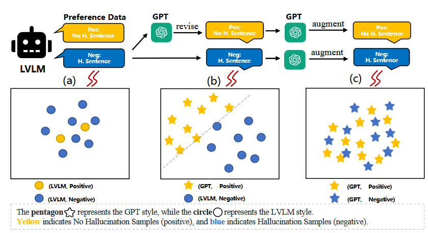
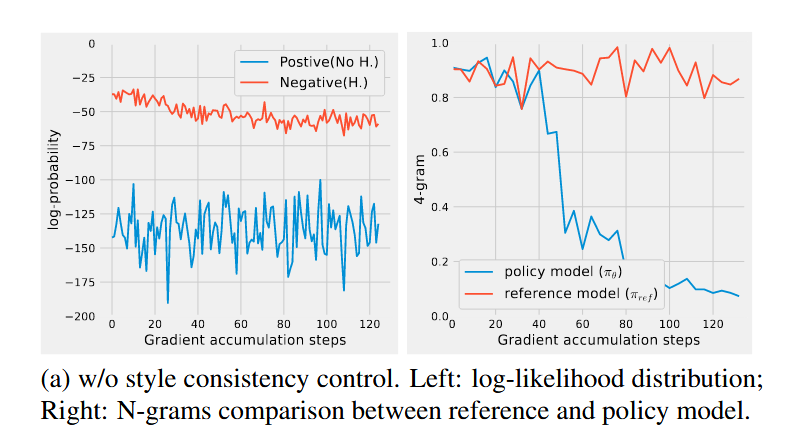
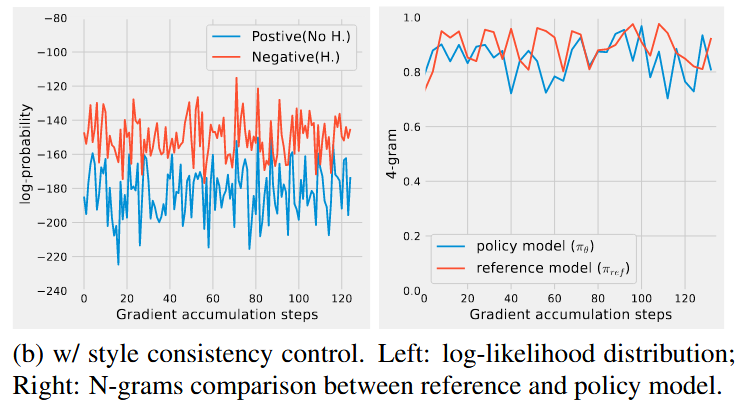

IEEE ICME 2025

#### 数据集构建

- 描述生成；（我们从VG数据集中随机选择图像，并使用LVLM生成相应的详细描述）
- 幻觉检测与纠正；（将模型生成的描述和原始图像的所有注释信息输入到GPT-4中，并提供详细的提示模板，使GPT-4能够检查生成的描述中是否存在幻觉。如果存在幻觉，则需要提供没有幻觉的纠正后描述。通过这种方式，我们可以获得与图像对应的正向和负向响应）
- 风格一致数据增强；（通过GPT-4重写前面的正负样本，保留其极性，将数据转化为带有正负答案对的问题，将这些问题输入给LVLM，根据先前的答案对响应进行采样，由此偏好学习数据包括表述性数据和问答数据）
- 最后将生成的编好数据集用于后续的HA-DPO模型训练；
#### 方法
##### 多模态幻觉感知DPO （MultiModal Hallucination-Aware DPO）
$$
L_{dpo}(\pi_{\theta};\pi_{ref}) = -E(x_{T},x_{I},y_{pos},y_{neg})\sim D[log \; \sigma(\beta \;log \frac{\pi_{\theta}(y_{pos}|[x_{T},x_{I}])}{\pi_{ref}(y_{pos}|[x_{T},x_{I}])}) - \beta \;log \frac{\pi_{\theta}(y_{neg}|[x_{T},x_{I}])}{\pi_{ref}(y_{neg}|[x_{T},x_{I}])})]
$$

- 其中$x_{T}\;x_{I}$ 表示文本和图像提示；
- $\pi_{ref} \; \pi_{\theta}$ 表示参考模型（奖励模型）和策略模型；
- 该函数目标是让奖励模型偏向于正向响应$y_{pos}$，拒绝响应$y_{neg}$ ;
隐式表示奖励模型$\hat r$：
$$
\hat r (x_T,x_{I},y) = \beta \; log \frac{\pi_{\theta}(y|[x_{T},x_{I}])}{\pi_{ref}(y|[x_{T},x_{I}])}
$$
- 最大化奖励边际$\hat r(x_{T},x_{I},y_{pos}) - \hat r(x_{T},x_{I},y_{neg})$，有效发大了$y_{pos}$的对数似然，缩小了$y_{neg}$的对数似。
辅助任务，将监督微调的梯度集成到偏好学习中：
$$
L_{aux} = -\sum log \;P(y|x_{P};\pi_{\theta}),\{x_{P},y\} \sim D_{sft}
$$
- $x_{P} \; y$ 是提示和相关的响应，$D_{sft}$表示sft训练阶段的数据集；
$$
L = L_{dpo} + \lambda L_{aux}
$$
用$\lambda$平衡偏好学习损失和辅助语言建模损失。

#### 分析
#### 为什么要风格一致

- 首先LVLM产生的响应其正负样本分布不均匀（a)，我们利用GPT-4修正幻觉对应的正向响应(b)，但b能看出来其正负样本具有的分布差异不是幻觉导致的，而是LVLM和GPT-4输出之间的文本差异，这可能会诱导DPO去学习模型的风格差异，而不是幻觉差异；
- 因此对b进行初始的正负样本进行增强，将正负样本均换为GPT-4的风格，这样HA-DPO输出才能学到对无幻觉的偏好；
具体看风格一致性对模型训练中“数据分布”和“句子流畅性”的影响：

未风格一致性对其前，左图能看出正负样本存在显著的分布差异，右图模型随着训练的增加句子流程性迅速下降，到达一定程度后其失去了表达能力。

风格对其后，左图能看出两类样本为相同的特征空间，句子在这种条件下训练右图能看出句子流畅性不会随训练二受到影响。

#### 基准
为了克服POPE的局限性，引入句子级幻觉率，SHR：
$$
SHR= \frac{\sum_{i=1}^{N} h_{i}}{\sum_{i=1}^{N} s_{i}}
$$
- $N$为图像总数；
- $s_{i} \; h_{i}$分别表示响应中所有句子的数量和带有幻觉的句子的数量；
- $h_{i}$ 的判定由GPT-4根据模型输出和当前图片响应的注释做出。

#### 实验
- **训练数据**：VG数据集，过滤信息后随机选择2K图像，幻觉数据集是使用 GPT-4 经过三次重写构建的，产生了 2K 张图像，包含 6K 个无幻觉响应和 6K 个幻觉响应。随着将描述性数据转换为问答格式，我们增加了大约 10K 个数据对用于训练，总计使用了 16K 个数据；
- **POPE评估**：