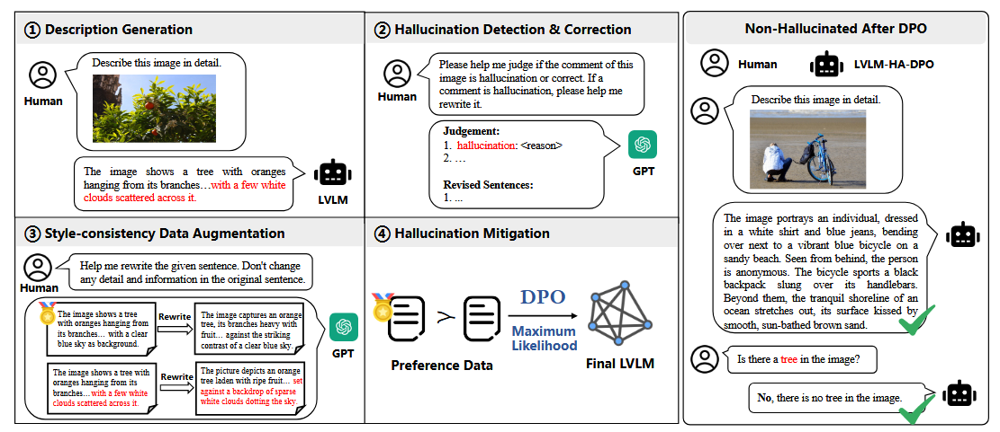

IEEE ICME 2025

#### 数据集构建

- 描述生成；（通过大视觉语言模型进行描述生成）
- 幻觉检测与纠正；（通过GPT-4检测并纠正模型中的幻觉）
- 风格一致数据增强；（通过GPT-4重写样本达到风格一致的数据增强）
- 最后将生成的编好数据集用于后续的HA-DPO模型训练；
#### 方法
##### 多模态幻觉感知DPO （MultiModal Hallucination-Aware DPO）

