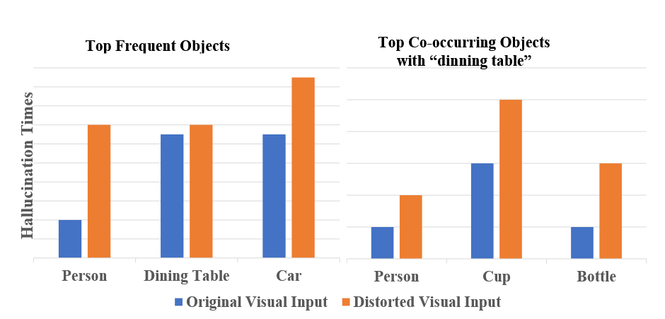

#### 幻觉的核心诱因
##### 引入视觉不确定性

通过原始图像增加高斯噪声掩码，方法遵循如下公式（参考DDPM）：
$$
q(v_t|v_{t-1}) = \mathcal{N}(v_t;\sqrt{1-\gamma} \; v_{t-1},\gamma \mathrm{I})
$$
$$
q(v_T|v_0) = \prod _{t=1}^T q(v_t|v_{t-1})
$$
- 第一个公式:
	$\sqrt{1 - \gamma} ； v_{t-1}$ 代表均值，$gamma$控制保留上一步的信息量；
	$\gamma \mathrm{I}$ 代表协方差，单位矩阵意味着每个图像的噪声相互独立，噪声强度由$\gamma$控制。
- 第二个公式：
	$v_{t}$只依赖$v_{t-1}$，从$v_0$到$v_T$的整体分布，就是每一步条件概率的连乘，t越大：噪声累积，原图可区分特征逐渐丢失，**不确定性升高**。
图中可以看出随着t的不断提升，LVLM更倾向于传统的香蕉颜色“黄色”、“绿色”，真实的黑色随着t增加不断失真，让LVLM更倾向于预训练的”黄色“、”绿色“这种先验知识。

图中左边，是基于MSCOCO中高频出现的物体，右图是经常出现在“餐桌”旁的三个物体，他们在失真视觉场景下，更易出现幻觉；其本质是因为MSCOCO数据集本身训练数据不均衡的物体分布和物体关联偏差的问题。

因此幻觉出现的核心诱因：
- 对大语言模型先验知识的过度依赖；
- 训练数据固有的统计偏差。

#### 视觉对比解码（Visual Contrastive Decoding）
模型生成两种分布：
- 基于原始图像的视觉输入$v$的分布；
- 基于对$v$添加的预设失真后的$v'$的分布。
然后利用这两种分布差异计算新的对比概率分布:
$$
P_{vcd}(y|v,v',x) = softmax[(1+\alpha)logit_{\theta}(y|v,x) - \alpha logit_{\theta}(y|v',x)]
$$
其中$\alpha$越大，二者差异放大越明显。

##### 增加合理性约束
