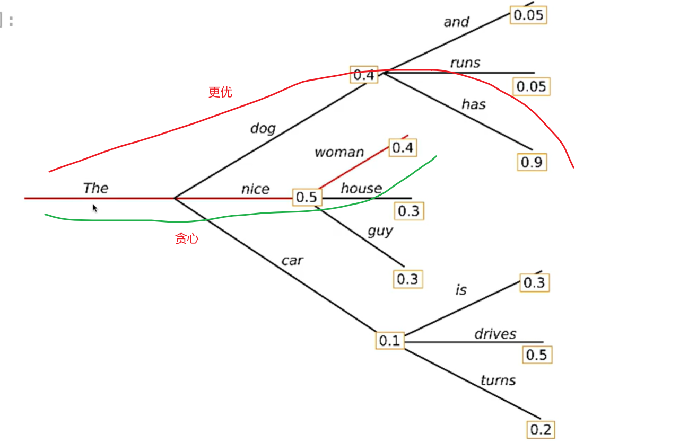

#### KL散度
KL散度也叫相对熵，作用是量化两个概率分布之间的差异程度；
##### 信息熵
对于离散随机变量$X$，其真实概率为$P$，信息熵$H(P)$公式为：
$$
H(P) = -\sum_{x}P(x)\log P(x)
$$
- 物理意义：描述分布P的固有不确定性，也代表**用最优编码方式对P编码时，所需的平均最小比特数**。
- 连续分布的熵（微分熵）：$H(P) = - \int p(x)\log p(x)dx$ ，其中$p(x)$是$P$的概率密度函数。
##### KL散度
离散分布：
$$
D_{KL}(P||Q) = \sum_x P(x)\log (\frac{P(x)}{Q(x)})
$$
连续型分布：
$$
D_{KL}(P||Q) = \int_{-\infty}^{\infty} p(x)\log (\frac{p(x)}{q(x)})dx
$$
- $P$：真实分布/目标分布；
- Q：近似分布/拟合分布；

$$
D_{KL}(P||Q) = H(P,Q) - H(P)
$$
当$P$是固定的真实分布时，$H(P)$是常数，**最小化交叉熵$H(P,Q)$完全等价于最小化 KL 散度$D_{KL}​(P||Q)$**。这就是分类任务中交叉熵损失的底层逻辑。
##### 性质
- $D_{KL}(P||Q) \geq 0$；
- 分布完全一致是KL为0；
- $D_{KL}(P||Q) \neq D_{KL}(Q||P)$;
#### BT模型（Bradley-Terry）
通过两两对决 / 偏好的观测数据，估计每个对象的潜在实力（偏好度），并预测未来成对比较的结果。
$$
P(i \succ j) = \frac{\lambda _i}{\lambda_i + \lambda_j}
$$
- 其中$P(i \succ j)$：对象$i$击败$j$的概率；
- $\lambda_{i}\lambda_{j}$：分别为对象$i$和$j$的实力参数，严格大于0；
在强化学习里：大模型输入的prompt是x，回答是y，回答好与坏通过reward模型评估：
$$
P(y_1 \succ y_2) = \frac{\exp({r(x,y_1)})}{\exp({r(x,y_1)}) +\exp({ r(x,y_2)})}
$$

我们知道sigmoid公式为：
$$
\sigma(x) =  \frac{1}{1+exp(-x)}
$$
可以将概率公式转化为:
$$
P(y_w \succ y_l) = \frac{1}{1 + exp(r(y_l) - r(y_w))} = \sigma(r(y_w) - r(y_l))
$$
假设训练集共有$N$个独立的成对偏好样本，每个样本为$(prompt^n,y_w^n​,y_l^n​)$，则全数据集的对数似然为所有样本的对数概率之和：
$$
log\mathcal{L}(r) = \sum_{n=1}^{N}logP(y_w^n \succ y_l^n) = \sum_{n=1}^N log\sigma(r(y_w^n) - r(y_l^n)) 
$$
我们的目标是最大化对数似然，等价于最小化负对数似然，最终得到**基于 BT 模型的奖励模型基础损失函数**：
$$
\mathcal{L}_{RM-BT} = -\frac{1}{N}\sum_{n=1}^N log\sigma(r(y_w^n) - r(y_l^n)) 
$$

#### 稠密模型与稀疏模型
按照向前传播时可学习参数和激活范围与计算方式分为：
- **稠密模型（Dense Model）**：处理任意输入时，**全部 / 绝大多数可学习参数都会被激活，全量参与矩阵运算**，计算量与总参数量呈强线性相关；
- **稀疏模型（Sparse Model）**：处理任意输入时，**仅激活与输入语义 / 任务相关的极小部分参数，绝大多数参数处于休眠状态不参与计算**，核心优势是实现了 “总参数量极大、单次计算量极小” 的解耦。
###### 稠密模型
以 Transformer 架构为例，自注意力层、前馈网络（FFN）的所有权重矩阵，都会和输入 token 的特征做完整的通用矩阵乘法（GEMM）；训练时每一轮迭代都会更新全量参数，推理时每一个输入都会触发全量参数的计算。
###### 稀疏模型
- 静态稀疏（权重稀疏）：
	核心原理：通过**模型剪枝、量化**等方式，将训练好的模型中权重绝对值极低、对输出贡献极小的参数永久置 0，把稠密权重矩阵转化为稀疏矩阵；推理时仅计算非零参数，降低计算量与显存占用。
- 动态稀疏（主流MoE）：
	核心原理：模型保留完整的全量参数，但将核心计算模块拆分为多个独立的**专家（Expert）子网络**，新增一个**路由网络（Router）**；处理输入时，路由网络仅将输入分配给 2-8 个与输入最匹配的专家，其余专家完全不参与计算；
	经典实现：Transformer 架构中，将原本每个 token 都要经过的 FFN 层，替换为 N 个并行的专家 FFN，每个 token 仅路由到少数专家完成计算，其余专家全程不参与运算。

#### Tokenizer和Embedding
| 维度          | Tokenizer（分词器）                                                               | Embedding（嵌入层）                                                    |
| ----------- | ---------------------------------------------------------------------------- | ----------------------------------------------------------------- |
| **功能**      | 文本预处理：将连续的字符串切分成离散的 “词 / 子词 / 字符”（Token），并映射为数字 ID。                          | 特征表示：将离散的 Token ID 转换为低维、稠密的连续向量（向量空间中的点）。                        |
| **输入输出**    | 输入：原始文本（如 "我爱 AI"）  输出：Token ID 序列（如 `[101, 2769, 4263, 10086, 102]`）。 | 输入：Token ID 序列  输出：向量序列（如形状为 `[seq_len, hidden_size]` 的张量）。 |
| **在模型中的位置** | 模型最外层的**预处理工具**（不属于神经网络参数）。                                                  | 神经网络的**第一层**（是可训练的参数矩阵）。                                          |
| **核心目的**    | 解决 “文本如何进入模型” 的问题（结构化）。                                                      | 解决 “语义如何被计算” 的问题（数值化）。                                            |
#### Beam Search

对于语言模型生成序列时，如果只用贪心选择最高概率token就可能错过更优的序列。
###### 核心思想
- 保留Beam宽度，定义保留的候选序列数（称为“束”）；
- 在每一步，从当前 ( k ) 个候选生成所有可能的后续token，计算得分；
- 保留得分最高的 ( k ) 个新候选，丢弃其余；
- 达到指定长度或遇到结束标志（如 `<EOS>`）。
###### 数学公式
- 设$x = [x_1, x_2, \cdots, x_t]$是当前序列；
- $V$是词汇表，$|V|$是词汇表大小；
- $P(X_{t+1}|x_1,\cdots , x_t)$是预测下一个token的概率。
Beam Search就是最大化目标序列的对数概率:
$$
Score(x1,\cdots,x_T) = \sum_{t=1}^{T}logP(x_t|x_1,\cdots,x_{t-1})
$$
- 对于当前k个beam，生成$k \times |V|$个候选；
- 更新分数$Score(x1,\cdots,x_t,x_{t+1}) = Score(x1,\cdots,x_t)+logP(x_{t+1}|x_1,\cdots,x_t)$;
- 保留top-k个候选。
##### Sentence-level Beam Search
句子级束搜索（也叫句级束搜索），是**以完整句子为基本搜索、评分和剪枝单位的束搜索核心变体**，核心是将常规 token 级束搜索「逐 token 生成、逐 token 剪枝」的逻辑，改为「先生成完整句子，再基于整句全局质量评分做剪枝」，彻底解决了 token 级束搜索的局部最优、句子完整性不足、长文本语义漂移等核心痛点，是长文本生成、文档级机器翻译、文本摘要等场景的核心解码方案。

####  高斯噪声（Gaussian Noise）
指噪声强度的概率分布服从正态分布（高斯分布）。

