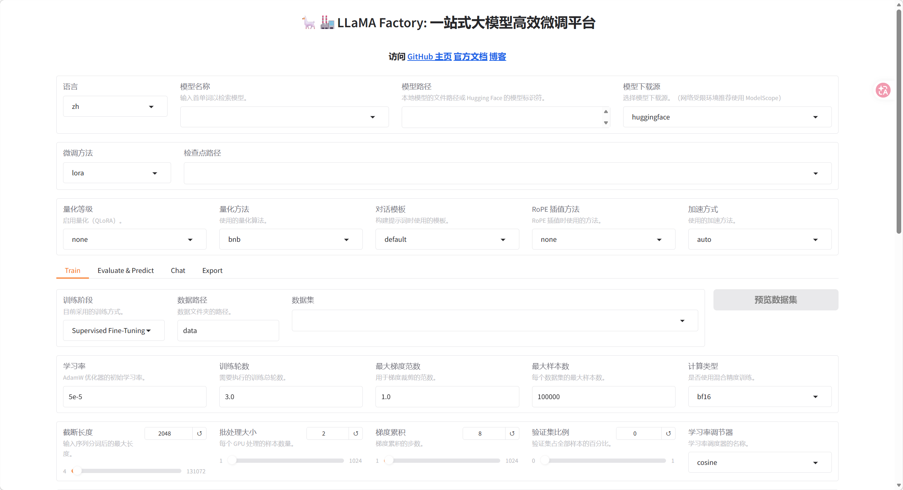

### 💩安装
#### ⛹️Windows
- conda 一个虚拟环境
	conda create -n llama_factory python=3.11
- 激活当前conda环境
	conda activate llama_factory
- 克隆目录，安装requirements
```bash
git clone --depth 1 https://github.com/hiyouga/LLaMA-Factory.git
cd LLaMA-Factory
pip install -e .
pip install -r requirements/metrics.txt
```
- 启动验证
	llamafactory-cli webui

- 重装PyTorch支持cuda版本:
	pip3 install torch torchvision --index-url https://download.pytorch.org/whl/cu128
