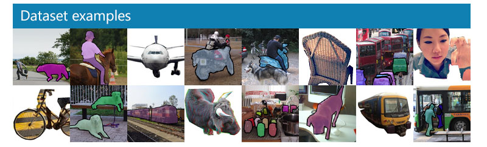

#### 🧬简介
MS COCO是一个非常大型且常用的数据集，其中包括了目标检测，分割，图像描述等。

包含：
- Object segmentation: 目标级分割
- Recognition in context: 图像情景识别
- Superpixel stuff segmentation: 超像素分割
- 330K images (>200K labeled): 超过33万张图像，标注过的图像超过20万张
- 1.5 million object instances: 150万个对象实例
- 80 object categories: 80个目标类别
- 91 stuff categories: 91个材料类别
- 5 captions per image: 每张图像有5段情景描述
- 250,000 people with keypoints: 对25万个人进行了关键点标注