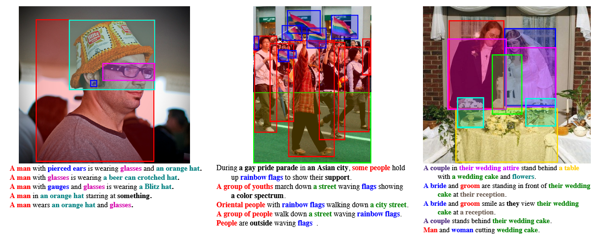

#### ⌚背景
- 经典的 Flickr8k 数据集仅包含 8000 张图像，规模过小，无法支撑深度模型的训练与泛化；而同期其他数据集要么标注句子过于简短、模板化严重，要么语义重复度高，无法建模复杂的视觉 - 语言对齐关系。
- 绝大多数数据集仅提供「图像 - 全局句子」的配对标注，没有文本短语与图像视觉区域的对应关系，无法支撑模型对实体、动作、属性的细粒度理解，也无法开展视觉定位、指代表达理解等细分任务的研究。
#### 🧬结构

- 训练集：29000 张图像，对应 145000 条描述句子
- 验证集：1000 张图像，对应 5000 条描述句子
- 测试集：1000 张图像，对应 5000 条描述句子