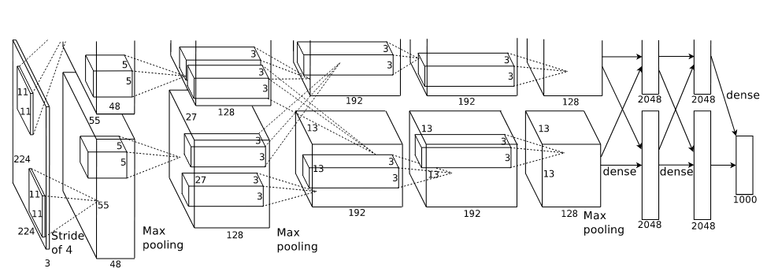
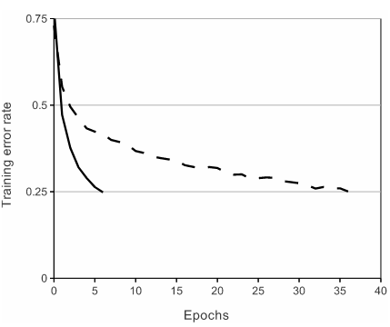

⌚2012:NeurIPS [@krizhevskyImageNetClassificationDeep2017]
##### 👀研究背景
此前图像分类多依赖人工设计特征（如 SIFT、HOG）+ 传统分类器，对大规模复杂数据集（如 ImageNet，含 120 万张图片、1000 个类别）的识别精度极低；浅层神经网络则存在梯度消失、训练效率低等问题，AlexNet 通过**深度 CNN + 工程优化**首次实现了大规模图像的高精度分类。
##### 🤖模型架构

| 层级     | 类型      | 参数设置                             | 输出尺寸      | 参数量            | 计算量（FLOPs）  |
| ------ | ------- | -------------------------------- | --------- | -------------- | ----------- |
| 0      | 输入层     | -                                | 224×224×3 | 0              | 0           |
| 1      | 卷积层     | in=3, out=96, k=11×11, s=4, p=2  | 55×55×96  | 34,944         | 105,415,200 |
| 2      | ReLU 激活 | -                                | 55×55×96  | 0              | 0           |
| 3      | LRN 归一化 | size=5, α=1e-4, β=0.75, k=2      | 55×55×96  | 0              | 0           |
| 4      | 最大池化    | k=3×3, s=2                       | 27×27×96  | 0              | 0           |
| 5      | 卷积层     | in=96, out=256, k=5×5, s=1, p=2  | 27×27×256 | 614,656        | 447,897,600 |
| 6      | ReLU 激活 | -                                | 27×27×256 | 0              | 0           |
| 7      | LRN 归一化 | size=5, α=1e-4, β=0.75, k=2      | 27×27×256 | 0              | 0           |
| 8      | 最大池化    | k=3×3, s=2                       | 13×13×256 | 0              | 0           |
| 9      | 卷积层     | in=256, out=384, k=3×3, s=1, p=1 | 13×13×384 | 885,120        | 149,512,192 |
| 10     | ReLU 激活 | -                                | 13×13×384 | 0              | 0           |
| 11     | 卷积层     | in=384, out=384, k=3×3, s=1, p=1 | 13×13×384 | 1,327,488      | 224,268,288 |
| 12     | ReLU 激活 | -                                | 13×13×384 | 0              | 0           |
| 13     | 卷积层     | in=384, out=256, k=3×3, s=1, p=1 | 13×13×256 | 884,992        | 149,512,192 |
| 14     | ReLU 激活 | -                                | 13×13×256 | 0              | 0           |
| 15     | 最大池化    | k=3×3, s=2                       | 6×6×256   | 0              | 0           |
| 16     | 展平层     | -                                | 9216      | 0              | 0           |
| 17     | 全连接层    | in=9216, out=4096                | 4096      | 37,752,832     | 37,748,736  |
| 18     | ReLU 激活 | -                                | 4096      | 0              | 0           |
| 19     | Dropout | p=0.5                            | 4096      | 0              | 0           |
| 20     | 全连接层    | in=4096, out=4096                | 4096      | 16,781,312     | 16,777,216  |
| 21     | ReLU 激活 | -                                | 4096      | 0              | 0           |
| 22     | Dropout | p=0.5                            | 4096      | 0              | 0           |
| 23     | 全连接层    | in=4096, out=1000                | 1000      | 4,097,000      | 4,096,000   |
| **总计** | -       | -                                | -         | **62,378,344** | **1.135B**  |
##### 💡核心方法
共**8 层可训练层**（5 层卷积层 + 3 层全连接层）。
- 卷积层（5 层）：逐步提取从低级（边缘、纹理）到高级（形状、物体部件）的图像特征，配合**重叠最大池化**（池化步长小于核大小）提升特征提取的丰富性；
- 全连接层（3 层）：将卷积提取的二维特征展平为一维向量，通过全连接映射到 1000 个输出节点，最后经**Softmax 激活函数**输出每个类别的概率；
- 输出层：对应 ImageNet 的 1000 个物体类别，实现图像的多分类。
##### 🎨关键创新

- **ReLU 非饱和激活函数**：替代传统的 tanh、sigmoid 饱和激活函数，公式为f(x)=max(0,x)。彻底解决了深层网络中饱和激活函数带来的梯度消失问题，在 CIFAR-10 数据集上，达到 25% 训练误差的速度比 tanh 快 6 倍，为深层网络的高效训练奠定了核心基础。
- **局部响应归一化（LRN）**：模拟生物神经元的侧抑制机制，对同一空间位置的相邻通道特征做归一化，公式为$b_{x, y}^{i}=a_{x, y}^{i} /\left(k+\alpha \sum_{j=max (0, i-n / 2)}^{min (N-1, i+n / 2)}\left(a_{x, y}^{j}\right)^{2}\right)^{\beta}$，超参数取k=2,n=5,α=10−4,β=0.75。该操作提升了模型泛化能力，使 top-1 和 top-5 错误率分别降低 1.4% 和 1.2%。
- 引入**Dropout 正则化**：随机失活部分神经元（论文中全连接层失活概率 0.5），有效防止大规模网络的**过拟合**；
- **双 GPU 并行训练**：将网络和数据拆分到两个 GPU 上并行计算，解决了单 GPU 的内存和计算量瓶颈，能处理更大的模型和数据集；
##### 🚀实验结果
- 在 ILSVRC2012 比赛中，AlexNet 的**Top-5 错误率仅为 15.3%**，远超第二名传统机器学习方法的 26.2%；
- 在 ImageNet 数据集的 1000 类分类任务中，首次证明了深度 CNN 在大规模图像识别中的有效性。
##### 📈影响
- 训练数据是通过原始图片训练网络，开启了**端到端深度学习**的 CV 新时代，CNN 成为图像识别、检测、分割等任务的基础；
- 证明了深度神经网络在大规模任务中的可行性。

