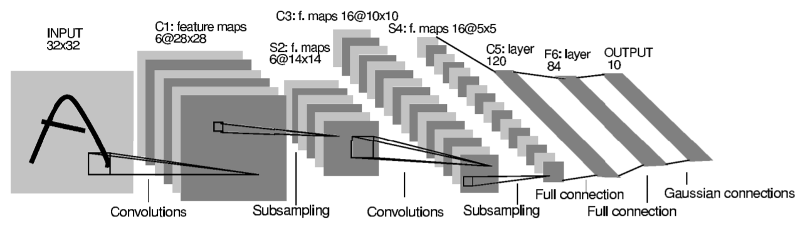
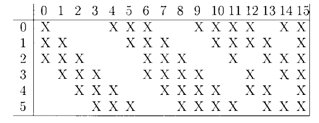

⌚1998：Proceedings of the IEEE
##### 👀研究背景
- 传统文档识别系统依赖手工设计的特征提取器和独立训练的多模块（如分割、识别、语言建模），不仅设计成本高，且模块间缺乏协同优化，难以应对手写字符的形变、位移等变异性。
- 早期机器学习方法受限于低维输入和简单决策函数，无法直接处理高维像素图像，且训练数据量不足、计算资源有限，导致识别精度难以突破。
- 手写字符识别、支票金额读取等实际场景对系统的鲁棒性（抗噪声、抗形变）和效率要求极高，传统方法难以满足工业级应用需求。
##### 🤖模型架构
整体架构图：


C3连接模式：前6个核以5×5的形式连接S2层的3个相邻的连续特征子图，接着6个核以5×5的形式连接4个相邻的连续特征子图，接着3个核连接4个不连续的特征子图，最后一个核连接全部特征子图。


| 层级  |   类型    |      参数设置       |   输出尺寸   | 参数                                              | 计算量    |
| :-: | :-----: | :-------------: | :------: | ----------------------------------------------- | ------ |
| 输入  |  原始图像   |    32×32 像素     |  32×32   | --                                              |        |
| C1  |   卷积层   |    6个5×5卷积核     | 28×28×6  | 156 = $(5 \times 5 + 1) \times 6$               | 122304 |
| S2  | 子采样（池化） |    2×2 平均池化     | 14×14×6  | --                                              | 5880   |
| C3  |   卷积层   |  16个卷积核（部分连接）   | 10×10×16 | 1516 (456 + 606 + 303 + 151)                    | 151600 |
| S4  |   子采样   |    2×2 平均池化     |  5×5×16  | --                                              | 122304 |
| C5  |   卷积层   | 120个全连接卷积核（5×5） | 1×1×120  | 48120 = $(5 \times 5 \times 16 + 1) \times 120$ | 48120  |
| F6  |  全连接层   |    120 → 84     |    84    | 10164 = $(1 \times 1 \times 120 \times 84)$     | 10164  |
| 输出  | RBF输出单元 |     10类数字识别     |    10    | 840                                             |        |
|     |         |                 |          |                                                 |        |
```python
import os

import torch

import torch.optim as optim

import torch.nn.functional as F

from torch import nn

from torchinfo import summary

from torchvision import transforms

from torchvision import datasets

from torch.utils.tensorboard import SummaryWriter

from torch.utils.data import DataLoader

device = torch.device("cuda" if torch.cuda.is_available() else "cpu")

class C3Layer(nn.Module):

    def __init__(self):

        super(C3Layer,self).__init__()

        self.in_channels = 6

        self.out_channels = 16

        self.kernel_size = 5

        self.padding = 0

        self.stride = 1

        self.valid_idx = [

            # 前6个：每组连3个

            [0,1,2],

            [1,2,3],

            [2,3,4],

            [3,4,5],

            [0,4,5],

            [0,1,5],

            # 中6个：每组连4个

            [0,1,2,3],

            [1,2,3,4],

            [2,3,4,5],

            [0,3,4,5],

            [0,1,4,5],

            [0,1,2,5],

            # 后3个：每组隔一个

            [0,1,3,4],

            [1,2,4,5],

            [0,2,3,5],

            # 最后1个：全6个

            [0,1,2,3,4,5],

        ]

        self.weights = nn.ParameterList([

            nn.Parameter(torch.randn(len(idx), 5, 5) * 0.01)

            for idx in self.valid_idx

        ])

        self.bias = nn.Parameter(torch.zeros(16))

    def forward(self,x):

        output = []

        for i in range(self.out_channels):

            x_in = x[:, self.valid_idx[i], :, :] #(batch_size,len(valid_idx),14,14)

            w = self.weights[i].unsqueeze(0)#(1,len(valid_idx),5,5)

            b = self.bias[i].unsqueeze(0)

            # 卷积计算（仅使用掩码选中的输入通道）x = (batch_size,len(valid_idx),14,14) , conv_out = (batch_size,1,10,10)

            conv_out = F.conv2d(x_in, w, b,stride=self.stride,padding=self.padding)

            output.append(conv_out)

        # output = 16 * (batch_size,1,10,10)        

        # 拼接所有输出通道 (batch_size,16,10,10)

        return torch.cat(output, dim=1)

  
  

class ScaleTanh(nn.Module):

    def __init__(self):

        super(ScaleTanh,self).__init__()

        self.A = 1.7159

        self.S = 2/3

    def forward(self,x):

        return self.A * torch.tanh(self.S * x)

class RBF(nn.Module):

    def __init__(self,in_features=84,out_features=10):

        super(RBF,self).__init__()

        self.in_features = in_features

        self.out_features = out_features

        self.weight = nn.Parameter((torch.randint(0, 2, (out_features, in_features)) * 2 - 1).float())

    def forward(self,x):

        x = x.unsqueeze(1)

        return torch.sum((x - self.weight)**2,dim=2)

  

class myLeNet5(nn.Module):

    def __init__(self):

        super(myLeNet5,self).__init__()

        self.scale_tanh = ScaleTanh()

        self.c1 = nn.Conv2d(in_channels=1,out_channels=6,kernel_size=5)

        self.s2 = nn.AvgPool2d(kernel_size=2)

        self.c3 = C3Layer()

        self.s4 = nn.AvgPool2d(kernel_size=2)

        self.c5 = nn.Conv2d(in_channels=16,out_channels=120,kernel_size=5)

        self.f6 = nn.Sequential(

            nn.Linear(in_features=(120),out_features=(84)),

            self.scale_tanh

        )

        self.rbf = RBF(in_features=84,out_features=10)

    def forward(self,x):

        x = F.relu(self.c1(x))

        x = self.s2(x)

        x = F.relu(self.c3(x))

        x = self.s4(x)

        x = F.relu(self.c5(x))

        x = x.view(x.size(0),-1)

        x = self.f6(x)

        output = self.rbf(x)

        return output

  
  
  

class MAPLoss(nn.Module):

    def __init__(self,j=1.0):

        super(MAPLoss,self).__init__()

        self.j = nn.Parameter(torch.tensor(j, dtype=torch.float32), requires_grad=False)

    def forward(self,outputs,labels):

        j_tensor = self.j.to(outputs.device)

        batch_size = outputs.shape[0]

        y_d = outputs[range(batch_size),labels]

        sum_exp = torch.sum(torch.exp(-outputs),dim=1)

        loss = y_d + torch.log(torch.exp(-j_tensor) + sum_exp)

        return torch.mean(loss)

if __name__ == '__main__':

    # 超参

    batch_size = 64

    learning_rate = 1e-2

    num_epochs = 10

    data_path = "./Datasets/MNIST"

    model_path = "./models"

    os.makedirs(data_path,exist_ok=True)

    os.makedirs(model_path,exist_ok=True)

    writer = SummaryWriter("runs/MNIST")

    # 下载数据集，加载数据集

    train_dataset = datasets.MNIST(root=data_path,train=True,download=False,transform=transforms.Compose([transforms.Pad(2),transforms.ToTensor()]))

    test_dataset = datasets.MNIST(root=data_path,train=False,download=False,transform=transforms.Compose([transforms.Pad(2),transforms.ToTensor()]))

    train_loader = DataLoader(train_dataset,batch_size=batch_size,shuffle=True,num_workers=2,drop_last=False)

    test_loader= DataLoader(test_dataset,batch_size=batch_size,shuffle=False,num_workers=2,drop_last=False)

  

    #加载模型、损失函数、优化器

    model = myLeNet5().to(device)

    summary(model,input_size=(1,1,32,32),device=str(device))

    loss_fn = MAPLoss(j=1.0)

    optimizer = optim.SGD(model.parameters(),lr=learning_rate)

    #训练、测试

    for epoch in range(num_epochs):

        print(f"---------------第 {epoch + 1} 轮训练开始---------------")

        model.train()

        running_loss = 0.0

        for i,(images,labels) in enumerate(train_loader):

            images = images.to(device)

            labels = labels.to(device)

            #向前传播

            outputs = model(images)

            loss = loss_fn(outputs,labels)

            #反向传播

            optimizer.zero_grad()

            loss.backward()

            optimizer.step()

            running_loss += loss.item()

            if (i+1) % 100 == 0:

                avg_loss = running_loss / 100

                print(f'Epoch [{epoch+1}], Step [{i+1}], Loss: {avg_loss:.4f}')

                writer.add_scalar('train_loss',avg_loss,epoch*len(train_loader)+i+1)

                running_loss = 0.0

        print(f"---------------第 {epoch + 1} 轮测试开始---------------")

        total = 0

        correct = 0

        model.eval()

        with torch.no_grad():

            for images,labels in test_loader:

                images = images.to(device)

                labels = labels.to(device)

                outputs = model(images)

                _,predicted = torch.min(outputs,1)

                total += labels.size(0)

                correct += (predicted == labels).sum().item()

        test_acc = 100 * correct / total

        print(f'Test Accuracy of the model: {test_acc:.2f} %')

        writer.add_scalar('test_acc',test_acc,epoch+1)

    torch.save(model.state_dict(),os.path.join(model_path,'LeNet5.pth'))

    print('model saved to ./models/LeNet5.pth')

    writer.close()
```
##### 💡核心方法
- 卷积神经网络（LeNet-5）：采用 “卷积层 + 下采样层” 交替结构，结合全连接层和 RBF 输出层，直接处理像素级输入。
- 梯度基学习：通过反向传播算法计算梯度，使用随机梯度下降（SGD）优化损失函数，支持全局训练。
- 图变换器网络（GTN）：将多模块系统建模为图变换过程，实现分割、识别等模块的联合训练。
- 空间位移神经网络（SDNN）：通过复制卷积网络扫描输入，避免显式字符分割。
##### 🎨关键创新
- 替代手工特征提取：CNN 通过数据驱动自动学习图像特征，打破了传统方法对专家经验的依赖，尤其适用于手写字符等复杂形变场景。
- 多模块全局优化：GTN 首次实现分割、识别、语言建模等模块的联合训练，解决了传统系统 “独立训练 + 手动调参” 的次优问题，提升整体性能。
- 无需显式分割：SDNN 利用 CNN 的鲁棒性和权值共享特性，通过扫描输入图像直接识别多字符，规避了分割错误导致的识别精度损失。
- 判别式训练范式：提出基于全局损失的判别式训练准则（如最大后验概率准则），不仅最小化正确路径的损失，还最大化错误路径的损失，增强模型区分能力。
- 工程化落地设计：LeNet-5 架构兼顾精度与效率，通过权值共享减少参数数量（仅 6 万个可训练参数），适配当时的硬件条件，支持工业级部署。
##### 🚀实验结果
- 手写数字识别（MNIST 数据集）
    
    - LeNet-5 在 6 万训练样本上的测试错误率低至 0.8%（含人工扭曲数据增强），优于线性分类器（12%）、K-NN（2.4%）、SVM（0.8%）等方法。
    - 训练数据量增加或引入随机形变增强后，模型泛化能力显著提升，无过拟合现象。
    
- 在线手写识别
    
    - 基于 GTN 和 AMAP 特征表示，单词级错误率低至 3.2%（25461 词词典约束），字符级错误率 1.4%，较字符级训练相对下降 30%。
    
- 支票金额读取系统
    
    - 商业部署于 NCR 公司，每天处理数百万张商业和个人支票，识别准确率 82%，错误率 1%，拒绝率 17%，突破银行行业 “50% 正确 / 1% 错误” 的经济可行性阈值。
##### 📈论文影响
- 技术范式影响：LeNet-5 成为 CNN 的经典基准架构，其局部感受野、权值共享等设计思想奠定了现代深度学习在计算机视觉领域的基础。
- 行业应用突破：首次实现文档识别系统的工业级落地，推动支票处理、邮政分拣等行业的自动化转型，验证了梯度基学习的实用价值。
- 方法论扩展：GTN 为多模块序列识别系统（如语音识别、自然语言处理）提供了全局优化框架，启发了后续 HMM 与神经网络的混合模型。
- 研究方向启发：确立了 “数据驱动特征学习” 替代 “手工特征设计” 的主流方向，推动了训练数据增强、判别式训练等技术的发展，影响了后续 ImageNet、目标检测等领域的研究。