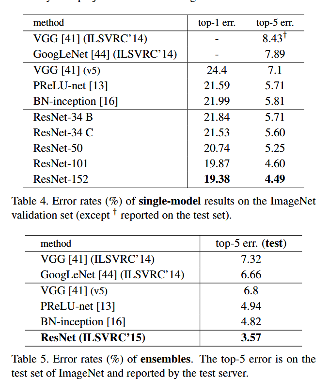

⌚2016:CVPR[@heDeepResidualLearning2015]
##### 👀研究背景
- **退化问题**：随着网络层数增加，**训练集准确率先上升后下降**，测试集准确率同步下降，且并非过拟合导致（过拟合表现为训练集准确率高、测试集低）；
- **梯度消失 / 爆炸**：早期深层网络训练困难的表面原因，可通过**批归一化（BN）**、权重初始化等方法有效缓解，但 BN 无法解决退化问题 —— 这说明退化是深层网络的**本质学习问题**，而非数值计算问题。
##### 🤖模型架构

- （layer < 50)每层层内输入输出通道数相同，直接将这一层的当前输入给这一层的下一层输入即可：如conv2_2 input = conv2_1 input + F(conv2_1 input)，layer >= 50 层间进行 x 的降为操作（kernel_size = 1 stride = 1 padding = 0) 进行尺寸改变后再 升维操作（kernel_size = 1 stride = 1 padding = 0)这样有助于减少计算量。
- 层间输入输出通道不同，如conv2 -- conv3 需要进行 x 的升维操作并进行下采样（kernel_size = 1 stride = 2 padding = 0)

##### 💡核心方法
- **恒等捷径（Identity Shortcut）**：当输入与分支输出的特征图尺寸、通道数完全一致时，直接将输入与分支输出相加，无任何额外参数和计算量，是 ResNet 的核心设计。
- **投影捷径（Projection Shortcut）**：当特征图下采样（尺寸减半）或通道数翻倍时，通过 1×1 卷积（步长与下采样一致）对输入进行线性变换，匹配分支输出的尺寸和通道数，仅在维度不匹配时使用。
##### 🎨关键创新
- 通过残差块加深网络的同时保持模型的收敛以及避免模型退化问题；
- 通过瓶颈残差块的设计减少了更深的模型的参数量与计算量；
##### 🚀实验结果

模型越深效果越好、考虑计算成本问题，投影捷径只在输入输出通道数不同时采用；
##### 📈影响
- 打破了深度模型模型退化问题；
- 成为CV领域的骨干网络；
- 其思想渗透NLP领域。