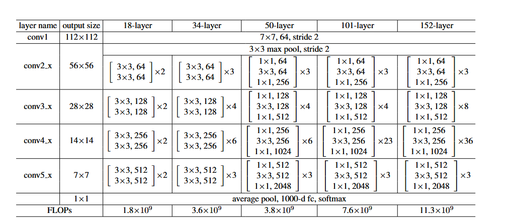

⌚2016:CVPR[@heDeepResidualLearning2015]
##### 👀研究背景
- **退化问题**：随着网络层数增加，**训练集准确率先上升后下降**，测试集准确率同步下降，且并非过拟合导致（过拟合表现为训练集准确率高、测试集低）；
- **梯度消失 / 爆炸**：早期深层网络训练困难的表面原因，可通过**批归一化（BN）**、权重初始化等方法有效缓解，但 BN 无法解决退化问题 —— 这说明退化是深层网络的**本质学习问题**，而非数值计算问题。
##### 🤖模型架构

- （layer < 50)每层层内输入输出通道数相同，直接将这一层的当前输入给这一层的下一层输入即可：如conv2_2 input = conv2_1 input + F(conv2_1 input)，layer >= 50 层间进行 x 的降为操作（kernel_size = 1 stride = 1 padding = 0) 进行尺寸改变后再 升维操作（kernel_size = 1 stride = 1 padding = 0)这样有助于减少计算量。
- 层间输入输出通道不同，如conv2 -- conv3 需要进行 x 的升维操作并进行下采样（kernel_size = 1 stride = 2 padding = 0)

##### 💡核心方法

##### 🎨关键创新

##### 🚀实验结果

##### 📈影响