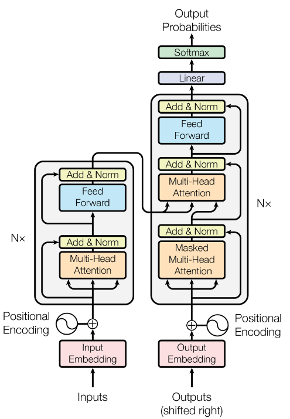

⌚2017:NeurIPS [@vaswaniAttentionAllYou2017]
##### 👀研究背景
- 循环神经网络虽然具有时序，但是其难以并行，且由于硬件限制其$h_t$难以做的很大，导致序列长度增加，导致前序语义的丢失；
- 卷积神经网络随具并行化，但想要抽取较远距离的关系需要较深的神经网络抽取，但其具有多输出模式可以抽取较为丰富的特征，因此Transformer提出多头注意力机制。

##### 🤖模型架构

- Transformer采用Encoder - Decoder 的自回归的架构。
- 
##### 💡核心方法

##### 🚀实验结果