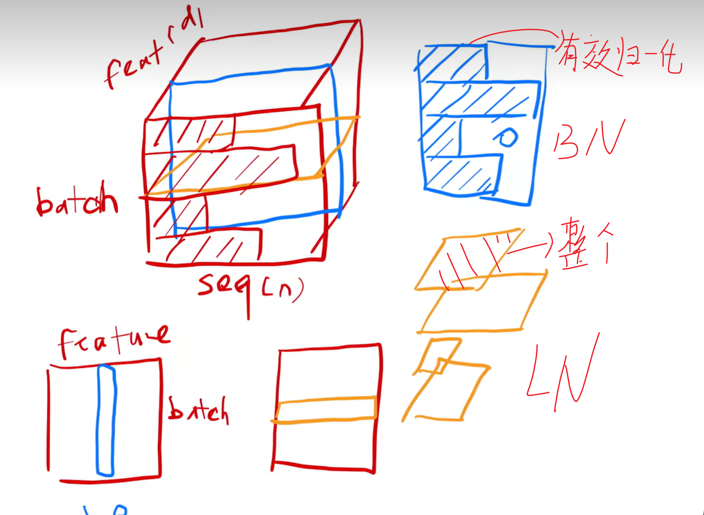

#### 🤖模型复杂度
##### 💩参数量
🤞神经网络模型所有**可以训练的**参数总量；包括：
- 全连接层的权重和偏置；
- 卷积层的权重和偏置；
- 归一化层的可学习的参数（如BatchNorm的γ和β）
🎓计算
- 全连接层：$(C_{in} \times C_{out} + bias)$
- 卷积层：$(K_{h} \times K_{w} \times C_{in} + bias) \times C_{out}$
- BatchNorm层：$2 \times channels（\beta 和 \gamma）$
PS：卷积输出尺寸公式：
$$
H_{out} = \lfloor \frac{H_{in} + 2\times padding - dilation \times (K_h - 1) - 1}{stride} + 1 \rfloor
$$
$$
W_{out} = \lfloor \frac{W_{in} + 2\times padding - dilation \times (K_w - 1) - 1}{stride} + 1 \rfloor
$$
##### 🏴‍☠️计算量
- FLOPs：每秒的浮点运算次数；
- GFLOPs：每秒浮点运算词数10亿次（10^9)
🎓计算
- 全连接层：$2 \times C_{in} \times C_{out}$
- 卷积层：$(2 \times K_{h} \times K_{w} \times C_{in} + bias) \times H_{out} \times W_{out} \times C_{out}$

#### 数据集任务
##### CV领域
###### 1. 图像分类数据集
- **MNIST/Fashion-MNIST**：入门级基准。MNIST 为 28×28 灰度手写数字，6 万训练 + 1 万测试样本，10 个类别；Fashion-MNIST 为服装灰度图，难度更高，是 MNIST 的替代基准，用于分类算法快速验证。
- **CIFAR-10/CIFAR-100**：轻量级图像分类基准。32×32 彩色图，CIFAR-10 含 10 个类别、6 万样本；CIFAR-100 含 100 个细分类别，适合小模型训练、算法快速迭代。
- **ImageNet-1K/ImageNet-22K**：CV 领域的标杆数据集。ImageNet-1K 含 128 万训练 + 5 万验证图像，1000 个通用类别，是深度学习模型预训练、分类任务的金标准；ImageNet-22K 为超大规模子集，22000 个类别，用于大模型预训练。
###### 2. 目标检测/实例分割数据集
- **COCO**：检测、分割、姿态估计的通用标杆。微软发布，33 万 + 高清图像，80 个通用目标类别，提供边界框、实例分割、人体关键点、全景分割标注，是目标检测算法的核心测试基准。
- **PASCAL VOC**：经典检测 / 分割基准。主流使用 VOC2007+VOC2012 组合，20 个目标类别，涵盖分类、检测、语义分割任务，是早期检测算法的核心基准，至今仍用于轻量化模型验证。
- **Open Images**：谷歌开源超大规模数据集，900 万 + 图像，600 + 目标类别，标注覆盖检测、分割、视觉关系，适合大规模预训练。
###### 3. 语义/全景分割数据集
- **Cityscapes**：自动驾驶场景分割标杆。5000 张精细标注 + 20000 张粗标注城市场景街景图，30 个语义类别，是自动驾驶、街景分割任务的核心基准。
- **ADE20K**：通用场景解析基准。MIT 发布，2 万 + 图像，150 个语义类别，覆盖室内外全场景，用于语义分割、全景分割、场景理解任务。
###### 4. 人脸与OCR专项数据
- **LFW**：无约束人脸验证基准，13000 + 人脸图像，5749 个身份，是人脸识别算法的入门级验证标准。
- **CelebA**：大规模人脸属性数据集，20 万 + 名人人脸图像，40 个维度的人脸属性标注（性别、表情、发型等），用于人脸识别、人脸生成、属性编辑。
- **ICDAR 系列**：自然场景 OCR 标杆，涵盖文本检测、文本识别任务，是 OCR 算法竞赛与落地的核心基准。
- **SynthText**：合成场景文本数据集，80 万 + 带文本标注的合成图像，用于 OCR 模型预训练。
##### NLP领域
###### 1. 文本分类/情感分析数据集
- **IMDB 影评**：二分类情感分析入门基准，5 万条电影评论，正负向各 2.5 万，标注清晰，适合入门级模型验证。
- **AG News**：短文本新闻分类基准，4 个新闻大类，12 万条标注样本，是短文本分类的高频使用数据集。
- **SST-2**：斯坦福情感树库，句子级细粒度情感二分类，是 GLUE 基准的核心子集，用于预训练模型语言理解能力验证。
###### 2. 通用语言理解与大模型基准
- **GLUE/SuperGLUE**：NLP 通用能力基准。GLUE 包含 9 个不同 NLP 任务（文本蕴含、语义相似度、情感分析等），是 BERT 等预训练模型的必测基准；SuperGLUE 为其升级版，难度更高，更考验模型的深层语言理解能力。
- **MMLU**：大模型通用能力标杆，57 个学科（人文、社科、理工、医学等）的多项选择题，测试模型的知识储备、零样本 / 少样本推理能力，是当前大语言模型的核心评测基准。
- **C4/Wikipedia 语料库**：大模型预训练核心语料。C4 为谷歌开源的万亿级 Token 干净网页文本；Wikipedia 多语言百科语料，几乎覆盖所有主流大语言模型的预训练环节。
###### 3. 机器翻译数据集
- **WMT 系列**：机器翻译领域年度竞赛基准，覆盖中英、英德、英法等数十种语言对，提供大规模高质量平行语料，是翻译模型的核心训练与评测基准。
- **IWSLT**：口语翻译轻量级基准，规模更小、场景聚焦口语对话，适合翻译模型入门与轻量化验证。
- **OPUS**：开源多语言平行语料库，覆盖上百种语言，包含海量垂直领域平行语料，是小语种翻译的核心资源。
###### 4. 阅读理解与问答数据集
- **SQuAD 1.1/2.0**：抽取式阅读理解标杆。1.1 版本含 10 万 + 问答对，基于维基百科文本；2.0 版本新增不可回答问题，大幅提升难度，是阅读理解任务的金标准。
- **HotpotQA**：多跳推理问答基准，需要模型跨多个文档、多步逻辑推理才能作答，考验模型的复杂推理能力。
- **VQAv2**：视觉问答多模态标杆，25 万 + 图像、100 万 + 问答对，是图文联合理解、多模态大模型的核心评测基准。
###### 5. 序列标注/信息抽取数据集
- **CoNLL-2003**：命名实体识别（NER）经典基准，英文 4 类实体标注（人名、地名、组织名、杂项），是 NER 任务的入门与通用评测标准。
- **MSRA NER**：中文 NER 经典基准，微软亚洲研究院发布，3 类核心实体标注，是中文 NER 任务的入门首选。
- **OntoNotes**：多语言多任务语料库，覆盖 NER、句法分析、共指消解等任务，支持中英等主流语言，是工业界信息抽取模型的核心训练资源。
##### 语音与音频处理领域
###### 1. 自动语音识别（ASR）数据集
- **LibriSpeech**：英文 ASR 标杆数据集，1000 小时有声书音频，带精准文本标注，分 clean/other 难度子集，是 ASR 模型预训练与评测的核心基准。
- **AISHELL-1/2**：中文普通话 ASR 经典数据集，AISHELL-1 为 178 小时单场景标注数据，AISHELL-2 为 1000 小时多场景大规模数据，是中文 ASR 入门与落地的核心资源。
- **Common Voice**：Mozilla 开源多语言语音数据集，覆盖上百种语言，千万级众包标注音频，开源免费，是小语种 ASR 的核心资源。
###### 2. 语音合成（TTS）数据集
- **LJSpeech**：英文单说话人 TTS 标杆，24 小时高质量英文朗读音频，带文本标注，几乎是所有 TTS 模型的入门训练基准。
- **Baker Dataset**：中文单说话人 TTS 经典数据集，12 小时标准普通话标注音频，是中文 TTS 入门首选。
- **VCTK**：多说话人英文 TTS 数据集，109 个不同口音说话人，44 小时标注音频，用于多说话人语音合成、音色迁移任务。
###### 3. 音频分类与事件检测数据集
- **AudioSet**：谷歌开源大规模音频数据集，200 万 + 10 秒音频片段，632 个音频事件类别，是音频分类、声音事件检测、音频预训练的核心基准。
- **ESC-50/UrbanSound8K**：入门级环境音频分类基准，ESC-50 含 50 个环境声音类别，UrbanSound8K 聚焦城市环境噪音分类，适合算法快速验证。
##### 多模态领域
- **LAION-5B**：超大规模图文对数据集，58 亿个图文匹配对，是 Stable Diffusion 等文生图模型、多模态大模型的核心预训练数据集。
- **Flickr30k/MSCOCO Captions**：图像字幕生成标杆，Flickr30k 含 3 万张图像、每张 5 句人工标注描述；COCO Captions 含 12 万张图像、60 万 + 描述，是图文匹配、图像字幕生成的核心基准。
- **LLaVA-Instruct**：多模态指令微调标杆数据集，用于多模态大模型的指令跟随、图文联合推理能力训练，是当前开源多模态大模型的核心微调资源。
#### 评分标准
##### CV领域
###### 1. 图像分类任务
- **基础通用指标**：准确率 (Accuracy)、精确率 (Precision)、召回率 (Recall)、F1-Score
	- 准确率 = 预测正确样本数 / 总样本数，是入门级通用指标；
	- 精确率（查准率）衡量模型不误报的能力，召回率（查全率）衡量模型不漏检的能力；
	- F1-Score 是精确率和召回率的调和平均，是类别不平衡场景的核心指标。
- **行业标杆指标**：**Top-1/Top-K 准确率**
	- 定义：Top-1 = 预测概率最高的类别与真实标签一致的样本占比；Top-5 = 预测概率前 5 的类别中包含真实标签的样本占比。
	- 适用场景：ImageNet 大规模分类数据集的通用标准，是分类模型性能的核心对标指标。
- **补充指标**：AUC-ROC、混淆矩阵，用于分析模型在不同类别上的表现。
###### 2. 目标检测任务
- **基础前提指标**：**IoU（交并比）**
    定义：预测边界框与真实边界框的交集面积 / 并集面积，衡量定位准确度，行业通用 IoU≥0.5 判定为正样本。
- **行业核心指标**：**AP（平均精度）、mAP（均值平均精度）**
    - 定义：AP 是单个类别在不同召回率下的精确率平均值；mAP 是所有类别 AP 的均值，是检测任务的金标准。
    - 关键区分：PASCAL VOC 标准为**mAP@0.5**（IoU≥0.5 时的 mAP）；COCO 标准为**mAP@[0.5:0.95]**（IoU 从 0.5 到 0.95、步长 0.05 的 10 个阈值的 mAP 平均值），难度更高，是当前检测算法的通用对标标准。
- **工业落地核心指标**：**FPS（每秒帧率）**，衡量模型推理速度，平衡精度与落地性能。
###### 3. 语义 / 实例分割任务
- **语义分割金标准**：**mIoU（均值交并比）**
    定义：每个类别预测像素与真实像素的 IoU 的平均值，值越高代表分割精度越高。
- **补充指标**：Dice 系数（医学影像分割首选，对小前景目标更友好）、像素准确率 (PA)、平均像素准确率 (MPA)。
- **实例分割核心指标**：沿用 COCO mAP 标准，同时结合掩码 IoU，兼顾目标检测与像素级分割精度。
###### 4. 图像生成 / 文生图任务
- **图像质量金标准**：**FID（弗雷歇 Inception 距离）**
    定义：衡量生成图像与真实图像在 Inception 模型特征空间中的分布差异，值越低，代表生成图像的质量、多样性与真实图像越接近，常用 FID-30k（基于 3 万张生成图计算）。
- **补充质量指标**：**IS（Inception Score）**，同时衡量生成图像的清晰度和多样性，值越高越好，现已逐步被 FID 替代。
- **主观金标准**：**MOS（平均主观意见分）**，1-5 分制，由人类对生成图像的质量、美观度、合理性打分。
###### 5. 人脸识别任务
- **核心指标**：**TAR@FAR**
    定义：固定误识率（FAR，把非本人误判成本人的概率）下的正确接受率（TAR，把本人正确识别的概率），行业通用标准为**TAR@FAR=0.001**（误识率 0.1% 时的正确识别率），LFW 数据集常用 1:1 人脸验证准确率。
- **补充指标**：EER（等错误率）、ROC-AUC，值越低代表模型性能越好。
##### NLP领域
###### 1. 文本分类 / 情感分析任务
- 核心指标：与分类任务通用的 Accuracy、Precision、Recall、F1-Score，类别不平衡场景（如垃圾文本识别、负面舆情检测）优先使用 F1-Score。
- 基准指标：GLUE/SuperGLUE 综合得分，是预训练语言模型通用理解能力的核心对标标准。
###### 2. 机器翻译任务
- **经典通用指标**：**BLEU 值**
    定义：基于 n-gram（连续 n 个词）的匹配度，衡量机器译文与人工参考译文的重合度，值越高（0-100）代表翻译准确度越高，是翻译任务的行业基础标准；局限性为仅关注词汇重合，不衡量语义通顺性。
- **进阶指标**：chrF（基于字符级匹配，对小语种更友好）、TER（翻译错误率，越低越好）、COMET（基于预训练模型的语义级评测，更贴合人类判断）。
- **主观金标准**：人工评分，衡量译文的准确性、流畅性、忠实度。
###### 3. 文本摘要 / 生成任务
- **核心金标准**：**ROUGE 值**
    定义：基于召回率的 n-gram 匹配指标，分 ROUGE-N（n 元语法匹配）、ROUGE-L（最长公共子序列匹配）、ROUGE-S（跳字匹配），值越高代表摘要与参考文本的信息重合度越高，是文本摘要任务的通用标准。
- **进阶指标**：BERTScore（基于预训练模型的上下文语义匹配，解决词汇不匹配但语义一致的问题）。
###### 4. 机器阅读理解 / 问答任务
- **核心标杆指标**：**EM（Exact Match，完全匹配率）**、**F1-Score**
    - EM：模型输出答案与标准答案完全一致的样本占比，要求最严格；
    - F1-Score：token 级别的匹配度，衡量答案的信息覆盖度，允许部分匹配，是 SQuAD 等阅读理解数据集的通用标准。
- **补充指标**：Hit@K，用于检索式问答、开放域问答任务。
###### 5. 序列标注任务
- **核心指标**：**实体级 Precision、Recall、F1-Score**
	- 关键规则：必须以完整实体为单位计算（如整个地名、人名完全匹配才算正确），而非单个 token / 字的匹配，是 NER 任务的行业通用标准。
###### 6. 大语言模型通用能力评测
- 核心基准：MMLU 准确率（57 个学科的知识与推理能力）、HumanEval/MBPP Pass@k（代码生成能力）、TruthfulQA（事实性准确率）。
##### 音频与语音处理领域
###### 1. 自动语音识别（ASR）任务
- **行业金标准**：**WER（词错误率，英文）、CER（字错误率，中文）**
	- 定义：`WER/CER = (替换错误数 + 删除错误数 + 插入错误数) / 参考文本的总词/字数`，值越低代表识别准确率越高。
- **补充落地指标**：SER（句错误率），整句话完全识别正确的比例，对工业级场景更有参考意义。
###### 2. 语音合成（TTS）任务
- **主观金标准**：**MOS（平均主观意见分）**
    1-5 分制，由人类对合成语音的自然度、清晰度、音色相似度、流畅度打分，是 TTS 任务的最终评判标准。
- **客观辅助指标**：MCD（梅尔倒谱失真，越低代表频谱与真实语音越接近）、F0 RMSE（基频误差，衡量语调准确度）、WER（合成语音转写后的词错误率，衡量可懂度）。
###### 3. 音频分类 / 声音事件检测任务
- 音频分类核心指标：Accuracy、mAP、F1-Score；
- 声音事件检测核心指标：F1@IoU、ER（错误率），需同时匹配音频事件的类别和起止时间，与 CV 目标检测逻辑一致。
###### 4. 说话人识别 / 验证任务
- **核心指标**：**EER（等错误率）**，误识率与拒识率相等时的错误率，值越低性能越好；行业通用辅助指标 TAR@FAR，与人脸识别逻辑一致。
##### 多模态领域
###### 1. 图文匹配 / 跨模态检索任务
- **行业金标准**：**Recall@K（R@1、R@5、R@10）**
    定义：分为文搜图（Text-to-Image）和图搜文（Image-to-Text）两个方向，Recall@K=Top-K 检索结果中包含匹配目标的样本占比，越高代表图文匹配能力越强。
    
    通用对标：行业常用 R@1、R@5、R@10 三个指标，是 CLIP 等多模态预训练模型的核心评测标准，也是 LAION-5B 预训练模型的核心性能对标指标。
- **补充指标**：mAP、MRR（平均倒数排名），衡量检索结果的排序质量。
###### 2. 图像字幕生成任务
- **核心首选指标**：**CIDEr（共识图像描述评价指标）**
    专门为图像字幕任务设计，基于 TF-IDF 加权的 n-gram 匹配，衡量生成字幕与多个人工参考字幕的共识度，是当前字幕任务的行业通用标准，值越高性能越好。
- **配套通用指标**：BLEU-1/2/3/4、ROUGE-L、**SPICE**（基于语义图匹配，更关注生成字幕的语义准确性和细节完整性）。
###### 3. 文生图 / 多模态生成任务
- **图文对齐核心指标**：**CLIP Score**
    基于 CLIP 模型计算生成图像与输入提示词的特征相似度，值越高代表生成图像与文本的语义匹配度越高，完美补充了 FID 仅关注图像质量、不关注图文对齐的缺陷，是文生图模型的核心多模态评测指标。
- **配套指标**：FID、IS（同 CV 生成任务）；主观金标准为人类 MOS 评分，综合评估图像质量、图文对齐度、美观度。
###### 4. 视觉问答（VQA）/ 多模态指令跟随任务
- **核心指标**：**VQA 整体准确率**
    模型输出答案与人工标注答案的匹配准确率，通常按问题类型细分（Yes/No 类、数字类、开放类），是 VQA 任务的金标准，也是 LLaVA 等多模态大模型指令微调后的核心评测指标。
- **配套指标**：EM（完全匹配率）、F1-Score（同 NLP 阅读理解任务）。
- **通用能力基准**：MMBench、MME、SEED-Bench 等多模态评测基准的综合得分，全面衡量多模态大模型的感知、推理、指令跟随能力。
###### 5. 多模态预训练模型通用评测
- 核心指标：Zero-Shot Recall@K（零样本跨模态检索能力）、Linear Probe Accuracy（线性探测分类准确率，衡量预训练特征的表征能力）。

#### 读论文
1. 标题 + 作者
2. 摘要
3. 结论
4. 导言
5. 相关工作
6. 模型
7. 实验
8. 评论
#### BatchNorm和LayerNorm
##### ICS
源空间和目标空间的数据分布不一致导致：
- 上层参数需要不断适应新的输入数据分布，降低学习速度；
- 下层输入的变化可能趋向变大或者变小，导致上层落入饱和区，是的学习过早停止；
- 每层更新会影响到其它层，更新参数的策略需要尽可能谨慎。

其核心目标是缓解ICS（内部协变量偏移问题），加速模型收敛、稳定训练过程以及缓解梯度消失/爆炸，有一定正则效果。

##### BatchNorm
对同一个通道的特征，在整个批次（batch）的样本、所有空间位置上统计均值和方差。
存在问题：每个样本序列长度不一定一致，导致归一化存在补零区域；
##### LayerNorm
在单一样本上进行统计，不存在