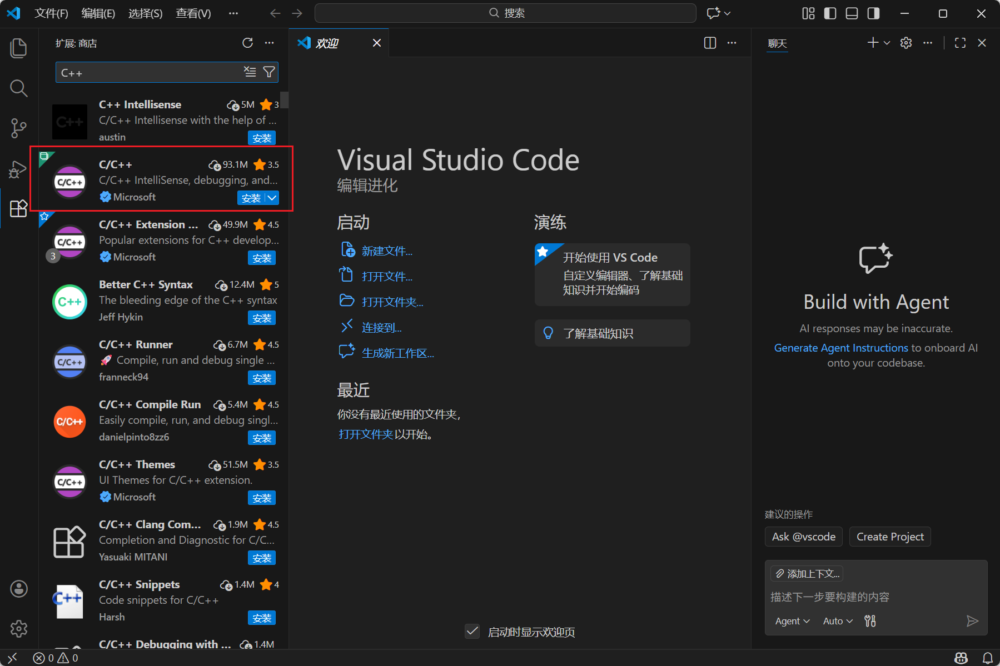

#### 安装软件
1. 下载VSCode，点击下载链接下载[Documentation for Visual Studio Code](https://code.visualstudio.com/docs/?dv=win64user)
2. 点击安装软件设置安装路径，如图所示。

3. 勾选前两项选择，这样可以右键打开文件和文件夹。

#### 安装插件
1. 汉化，在插件市场搜索Chinese，安装，如图所示，重启后生效。

2.   
	- 先下载mingw，配置C++基础环境，点击下载链接进行下载[MinGW-w64 - for 32 and 64 bit Windows download | SourceForge.net](https://sourceforge.net/projects/mingw-w64/)如图所示。
	- C++插件，在插件市场搜索C++，安装，如图所示。

