#### 安装软件
1. 下载VSCode，点击下载链接下载[Documentation for Visual Studio Code](https://code.visualstudio.com/docs/?dv=win64user)
2. 点击安装软件设置安装路径，如图所示。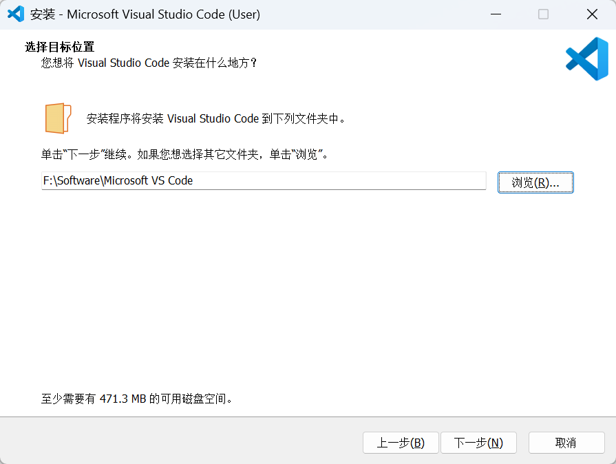

3. 勾选前两项选择，这样可以右键打开文件和文件夹。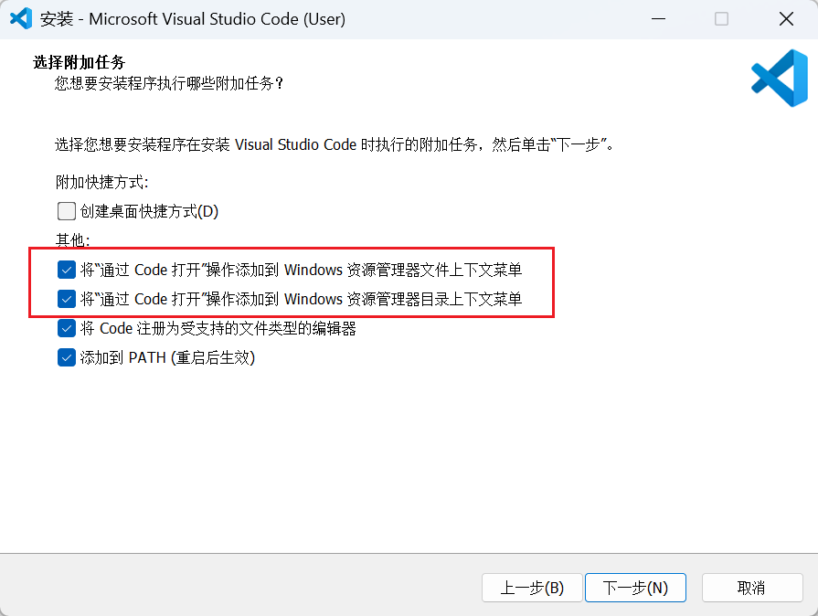

#### 安装插件
1. 汉化，在插件市场搜索Chinese，安装，如图所示，重启后生效。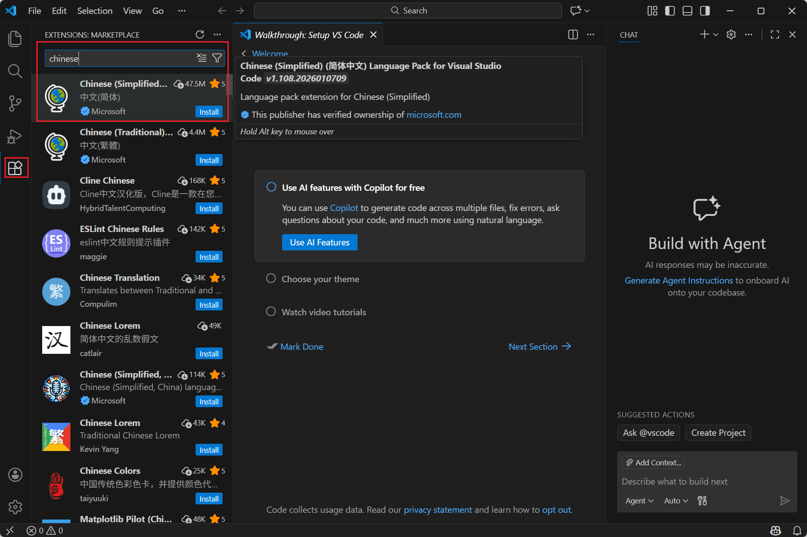

2. C++配置及插件
	1. -先下载mingw，配置C++基础环境，点击下载链接进行下载[Releases · niXman/mingw-builds-binaries](https://github.com/niXman/mingw-builds-binaries/releases)如图所示。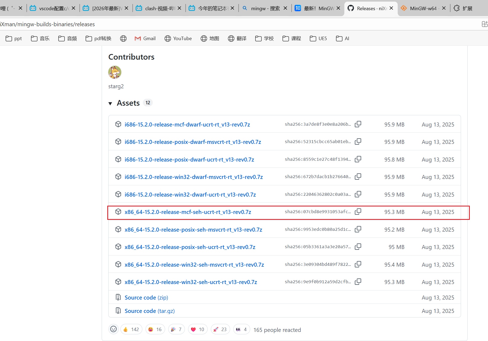
	2. 下载完成后解压到指定目录，如F:\Environments\mingw64
	3. 配置环境变量，如图所示。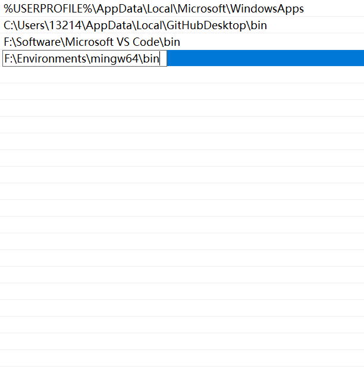
	4. 完成后打开cmd，输入gcc --version，看到如图所示即配置成功。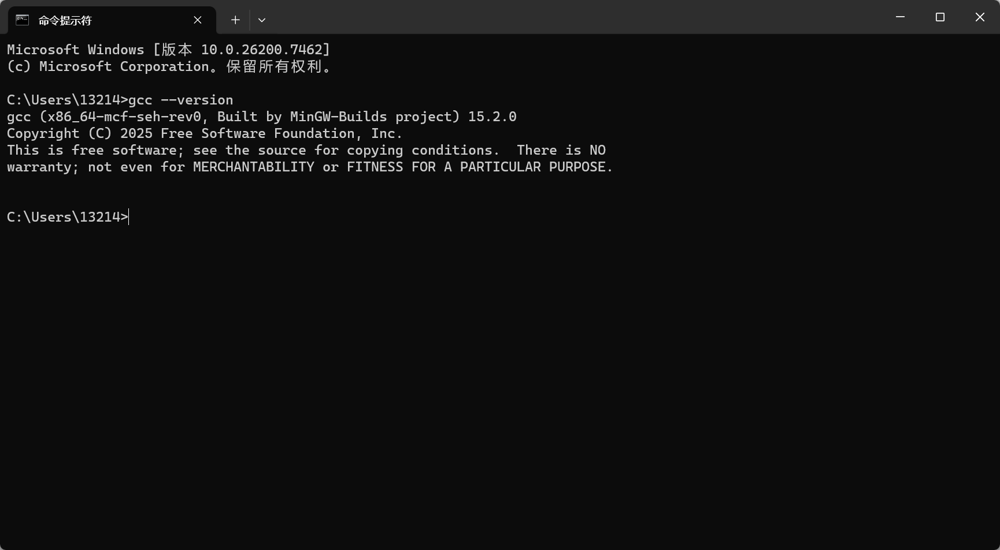
	5. C++插件，在插件市场搜索C++，安装，如图所示。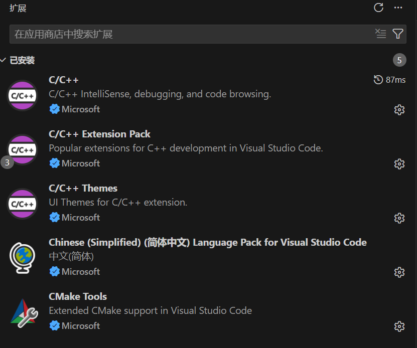
	6. 创建一个文件夹，并进行添加测试文件和代码。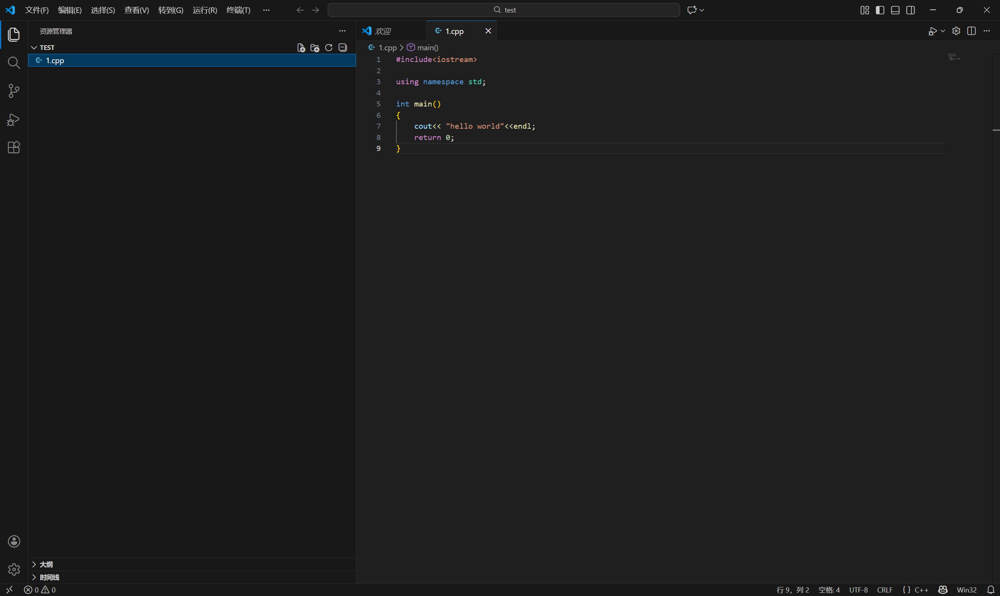
	7. 点击运行。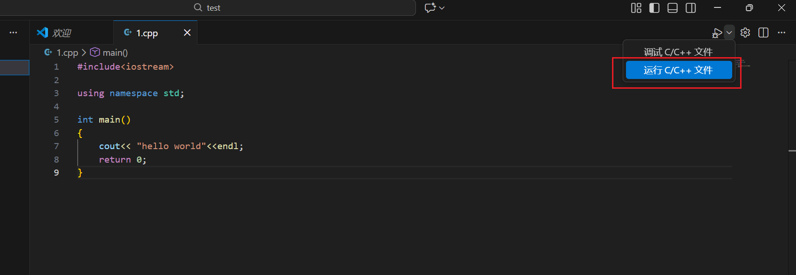
	8. 选择编译器。
	9. 在终端可以看见输出结果。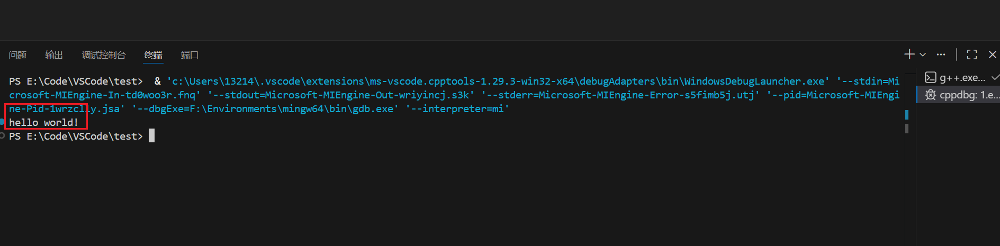

3. Anaconda环境
	1. 点击下载链接，登录账号，完成后下载。[Download Success | Anaconda](https://www.anaconda.com/download/success)
	2. 点击安装，选择安装地址。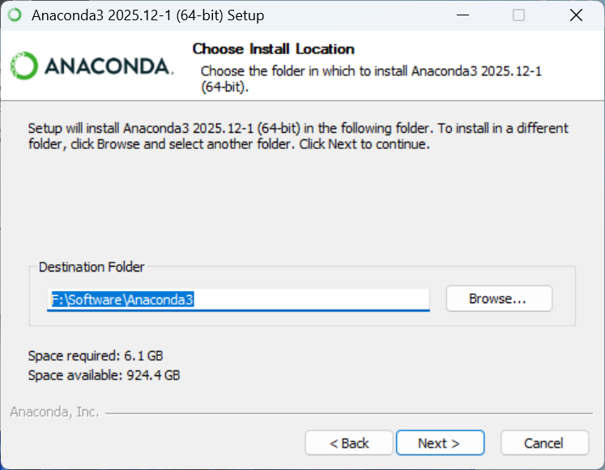
	3. 勾选安装选项。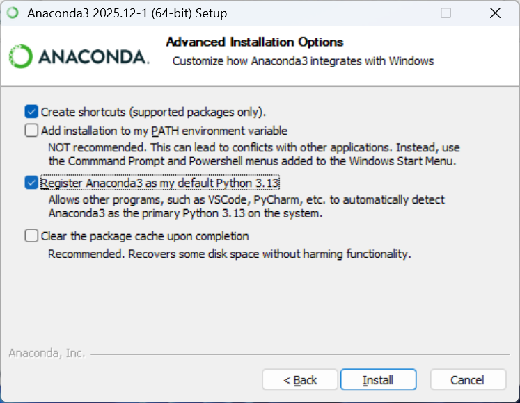