#### 安装软件
1. 下载VSCode，点击下载链接下载[Documentation for Visual Studio Code](https://code.visualstudio.com/docs/?dv=win64user)
2. 点击安装软件设置安装路径，如图所示。

3. 勾选前两项选择，这样可以右键打开文件和文件夹。

#### 安装插件
1. 汉化，在插件市场搜索Chinese，安装，如图所示，重启后生效。

2. C++配置及插件
	1. -先下载mingw，配置C++基础环境，点击下载链接进行下载[Releases · niXman/mingw-builds-binaries](https://github.com/niXman/mingw-builds-binaries/releases)如图所示。
	2. 下载完成后解压到指定目录，如F:\Environments\mingw64
	3. 配置环境变量，如图所示。
	4. 完成后打开cmd，输入gcc --version，看到如图所示即配置成功。
	5. C++插件，在插件市场搜索C++，安装，如图所示。
	6. 创建一个文件夹，并进行添加测试文件和代码。
	7. 点击运行。
	8. 选择编译器。
	9. 在终端可以看见输出结果。

3. Anaconda环境
	1. 点击下载链接，登录账号，完成后下载。[Download Success | Anaconda](https://www.anaconda.com/download/success)
	2. 点击安装，选择安装地址。
	3. 勾选安装选项。
	4. 完成后配置环境变量。将如下路径添加进环境变量中。
		- F:\Software\Anaconda3
		- F:\Software\Anaconda3\Scripts
		- F:\Software\Anaconda3\Library\bin
		- F:\Software\Anaconda3\Library\mingw-w64\bin
		- F:\Software\Anaconda3\Library\usr\bin
		如图所示。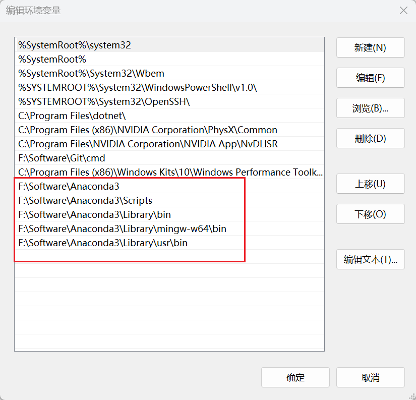
	5. 打开cmd，输入conda env list，检验命令是否有效，如图。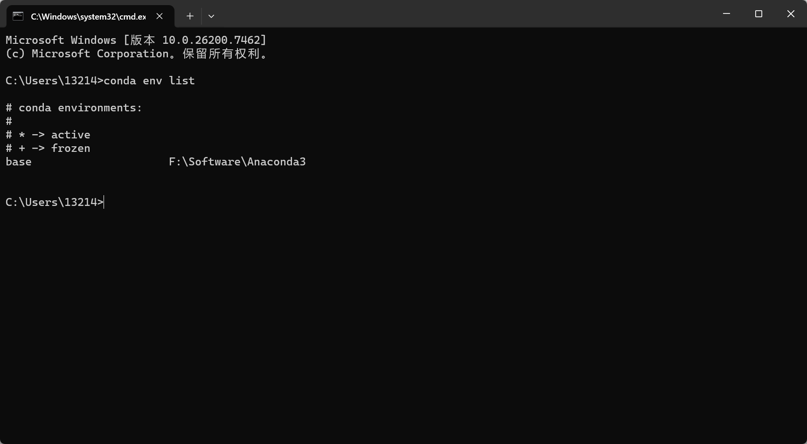

4. 安装配置深度学习环境
	1. cuda环境，使用nvidia-smi命令查看cuda版本。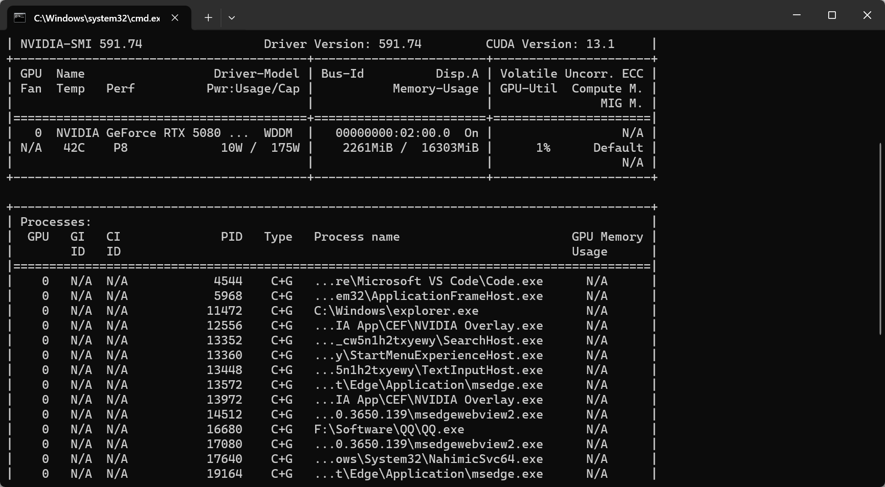
	2. 下载链接，[CUDA Toolkit 12.4 Update 1 Downloads | NVIDIA 开发者](https://developer.nvidia.cn/cuda-downloads?target_os=Windows&target_arch=x86_64&target_version=11&target_type=exe_local)如图。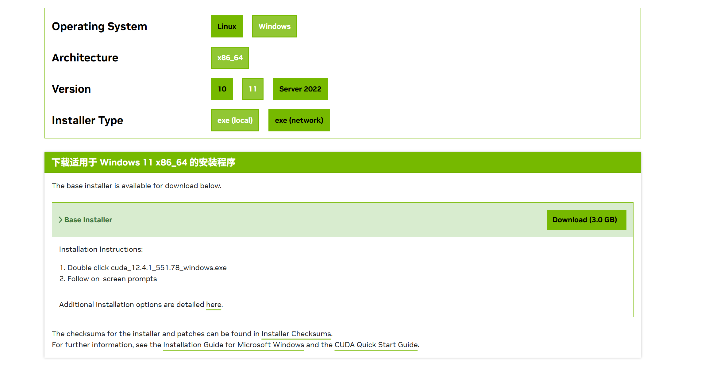
	3. 点击安装，第一个界面可以不用管，因为是零时文件安装完成后就删除了。
		- 点击OK即可。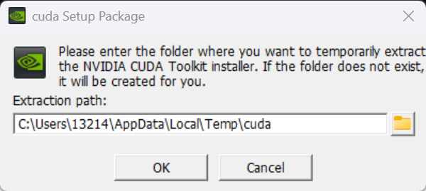
		- 选择自定义安装。
		- 在cuda中可以看到Visual Studio Integration，要安装这个选项需要确认自己是否有VisualStudio以及在VisualStudio中安装了这个Integration插件，如果没有就取消勾选，如果有就选。这里演示如何安装这个插件。来到VS中如图所示。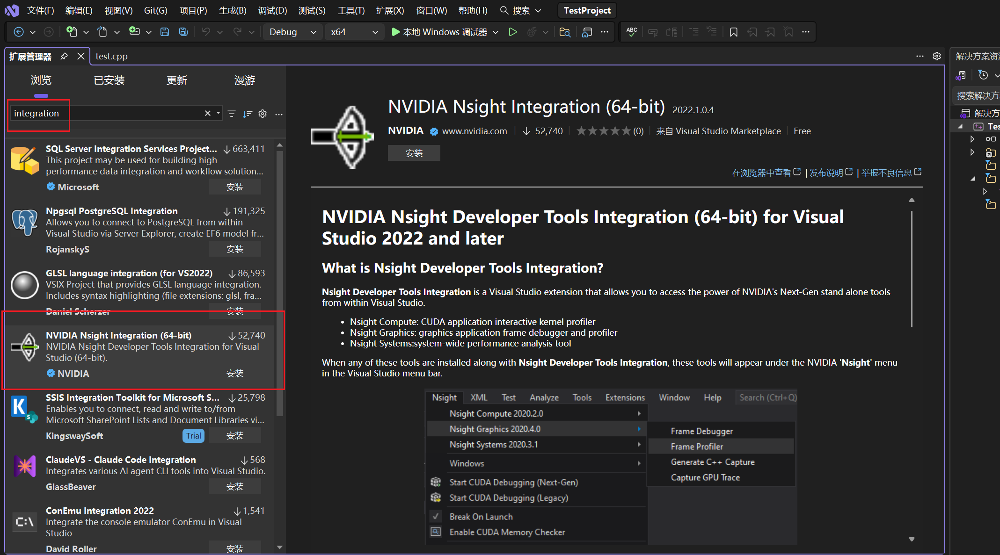
		- 安装完成后需要退出VS生效。如果碰到无法安装成功的情况，这是因为Unity3D.x64为安装，这里需要安装一下VS中的游戏开发组件即可（可能需要魔法）。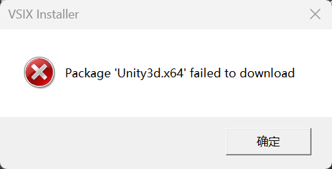
		- 点击下一步。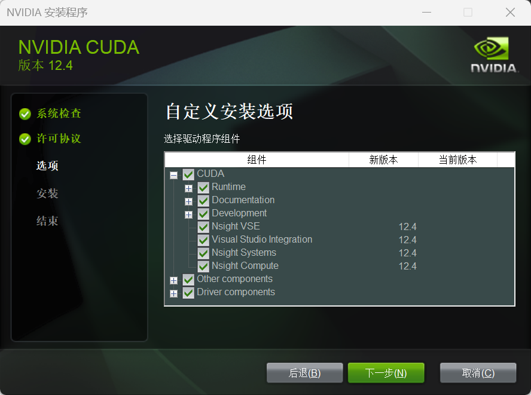
		- 选择安装路径，然后安装即可。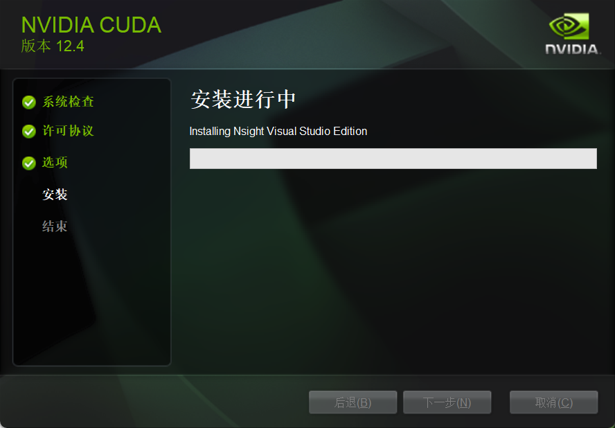
		- 打开cmd输入nvcc -V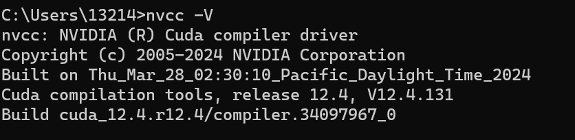
	4. 来到Pytorch官网，找到适合自己版本的Pytorch对应的命令。[Get Started](https://pytorch.org/get-started/locally/?_gl=1*16bqkdm*_up*MQ..*_ga*MTg0NjcyNTAxLjE3NjgyMDU4Nzc.*_ga_469Y0W5V62*czE3NjgyMDU4NzUkbzEkZzAkdDE3NjgyMDU4NzUkajYwJGwwJGgw)，如图。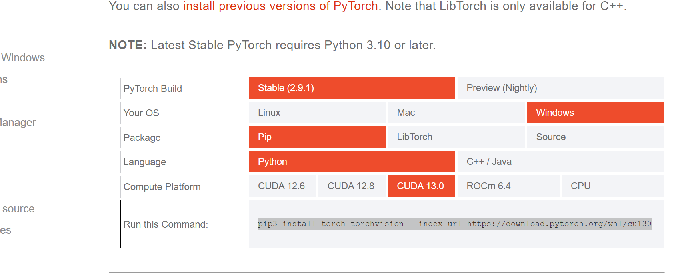
	5. 在对应的conda虚拟环境内输入该命令，下载即可。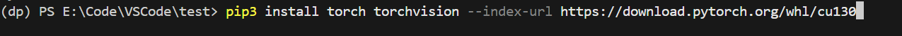
	6. 运行测试文件。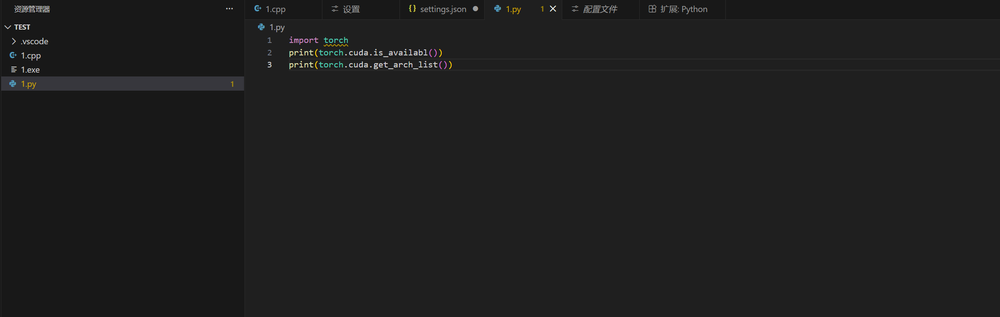
	7. 结果如下。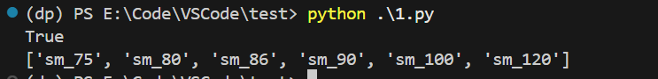
	8. 安装Transformers库，使用命令pip install transformers即可。
5. 与WSL联动，输入命令 code --install-extension ms-vscode-remote.remote-wsl安装即可
	- cuda环境[CUDA Toolkit 13.1 Update 1 Downloads | NVIDIA Developer]按照图中命令在wsl里输入命令即可(https://developer.nvidia.com/cuda-downloads?target_os=Linux&target_arch=x86_64&Distribution=WSL-Ubuntu&target_version=2.0&target_type=deb_local)
	- 安装好后使用命令#echo -e '\nexport PATH=/usr/local/cuda-13.1/bin:$PATH\nexport LD_LIBRARY_PATH=/usr/local/cuda-13.1/lib64:$LD_LIBRARY_PATH\nexport CUDA_HOME=/usr/local/cuda-13.1' >> ~/.bashrc，然后重启终端即可。
	- 