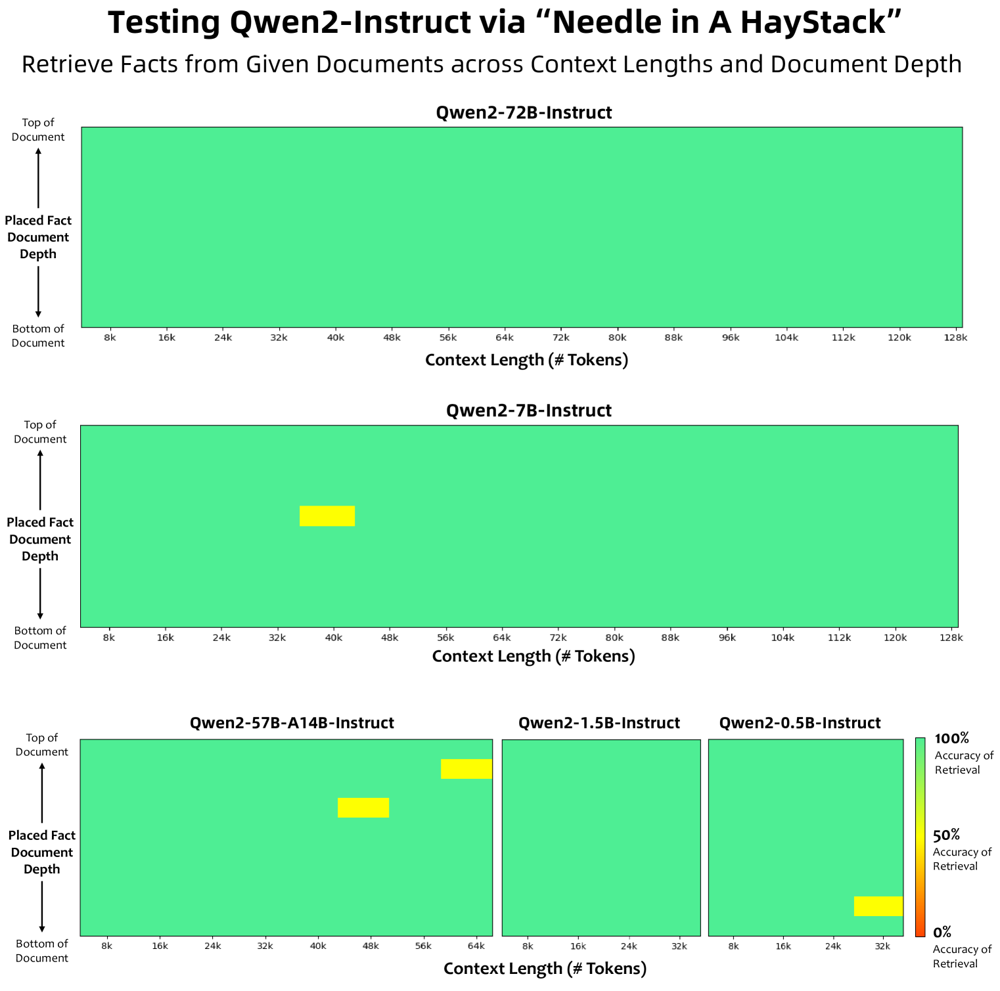

# 论文笔记：Qwen2 Technical Report

## 元信息

| 项目 | 内容 |
|------|------|
| 机构 | Qwen Team, Alibaba Group |
| 日期 | September 2024 |
| 项目主页 | [Qwen2 Blog](https://qwenlm.github.io/blog/qwen2/) |
| 对比基线 | [[Qwen1.5]], [[Llama-3]], [[Mixtral]], [[Gemma]], [[GPT-4o]] |
| 链接 | [arXiv](https://arxiv.org/abs/2407.10671) / [Code](https://github.com/QwenLM/Qwen2) / [HuggingFace](https://huggingface.co/Qwen) |

---

## 一句话总结

> Qwen2 系列 LLM：0.5B-72B 参数、密集+MoE 架构、7T tokens 预训练、DPO 对齐，全面超越 Qwen1.5 并在多数 benchmark 上媲美 Llama-3。

---

## 核心贡献

1. **全面的模型系列**: 发布 Qwen2 系列，包含 4 个密集模型 (0.5B/1.5B/7B/72B) 和 1 个 [[Mixture-of-Experts|MoE]] 模型 (57B-A14B)，覆盖从端侧到云端的部署需求
2. **高质量预训练数据处理**: 基于 Qwen1.5 的数据进行质量增强、数量扩充（3T→7T tokens）、分布优化，引入大规模代码和数学数据显著提升推理能力
3. **长上下文能力**: 通过 YARN + [[Dual Chunk Attention|DCA]] 将上下文窗口从 4K 扩展到 32K（预训），并可外推至 128K tokens
4. **可缩放的对齐策略**: 以最小人工标注实现 SFT + DPO 对齐，结合协同数据标注与自动化数据合成

---

## 问题背景

### 要解决的问题
在 Llama-3 等开源模型快速追赶 GPT-4 的趋势下，需要新一代 Qwen 系列 LLM 以保持竞争力，同时为社区提供高质量的开源模型权重。

### 现有方法的局限
Qwen1.5 的预训练数据仅 3T tokens，代码和数学能力较弱；上下文窗口限于 4K；未充分探索 MoE 架构的效率优势。

### 本文的动机
通过数据规模扩展、模型架构改进（GQA + MoE）、长上下文训练和可缩放对齐策略，全面提升 Qwen 系列的能力。

---

## 方法详解

### Tokenizer

沿用 Qwen ([[Qwen]]) 的 [[Byte-level BPE]] tokenizer，词汇量为 **151,643** 个常规 token + 3 个控制 token。该 tokenizer 编码效率高，压缩率优于同类方法，支撑多语言能力。出于分布式训练考虑，embedding 的有效大小略大于词汇量。

### 模型架构

Qwen2 系列基于 [[Transformer]] 架构，使用 [[Causal Attention|因果自注意力]] 和 next-token prediction 训练。系列包含 4 个 [[Dense Model|密集模型]] 和 1 个 [[Mixture-of-Experts|MoE]] 模型。

#### 密集模型 (Dense Models)

Qwen2 密集模型由多个 Transformer 层组成，每层包含因果注意力和 [[Feed-Forward Network|FFN]]。相对 Qwen1.5 的关键改进：

- **[[Grouped Query Attention|GQA]]**: 替代传统 [[Multi-Head Attention|MHA]]，减少 [[KV Cache]] 推理时的内存占用，显著提升吞吐
- **[[Dual Chunk Attention|DCA]] + [[YaRN|YARN]]**: DCA 将长序列分块，捕获块内和跨块的相对位置信息；YARN 重缩放注意力权重以增强长度外推
- 继续使用: [[SwiGLU]] 激活、[[RoPE|Rotary Positional Embeddings]]、[[QKV Bias|QKV bias]]、[[RMSNorm]]、[[Pre-normalization]]

#### MoE 模型

Qwen2 MoE (57B-A14B) 继承自 Qwen1.5-MoE-A2.7B 架构。MoE FFN 替代原始 FFN，包含 $n$ 个独立专家 FFN，每个 token 通过门控路由到特定专家。

**关键设计**:

- **[[Fine-grained Experts|细粒度专家]]**: 采用更小规模的专家单元，但同时激活更多专家（8 个路由专家 + 8 个共享专家），在相同的总参数量和激活参数量下提供更丰富的专家组合
- **[[Shared Expert Routing|共享与路由专家]]**: 引入共享专家处理通用任务，路由专家负责特定场景，提升 MoE 路由的适应性和效率
- **[[Upcycling|专家初始化]]**: 从密集模型权重初始化，将 FFN 复制 $\lceil n \times h_E / h_{FFN} \rceil$ 次，并在中间维度打乱参数以确保专家多样性，每个细粒度专家随机重初始化 50% 参数

#### 模型配置

| 配置项 | 0.5B | 1.5B | 7B | 72B | 57B-A14B (MoE) |
|--------|------|------|----|-----|-----------------|
| Hidden Size | 896 | 1,536 | 3,584 | 8,192 | 3,584 |
| # Layers | 24 | 28 | 28 | 80 | 28 |
| # Query Heads | 14 | 12 | 28 | 64 | 28 |
| # KV Heads | 2 | 2 | 4 | 8 | 4 |
| Head Size | 64 | 128 | 128 | 128 | 128 |
| Intermediate Size | 4,864 | 8,960 | 18,944 | 29,568 | 2,560 |
| # Routed Experts | - | - | - | - | 64 |
| # Activated Experts | - | - | - | - | 8 |
| # Shared Experts | - | - | - | - | 8 |
| Embedding Tying | True | True | False | False | False |
| Vocabulary Size | 151,646 | 151,646 | 151,646 | 151,646 | 151,646 |
| # Trained Tokens | 12T | 7T | 7T | 7T | 4.5T |

### 预训练 (Pre-training)

#### 预训练数据

Qwen2 的预训练数据在 Qwen1.5 的基础上进行了三方面改进：

1. **质量增强**: 精炼过滤算法，添加启发式和基于模型（Qwen 模型自身）的过滤方法，同时使用 Qwen 模型合成高质量预训练数据
2. **数据扩充**: 相比 Qwen1.5，收集了更大规模的高质量代码、数学和多语言数据，支持约 30 种语言
3. **分布优化**: 在缩小模型上实验以优化不同来源和领域数据的混合比例

最终预训练数据从 Qwen1.5 的 3T tokens 扩展到 **7T tokens**（高质量）。尝试放宽质量阈值得到 12T tokens 数据集，但未显著提升性能。Qwen2-0.5B 使用 12T tokens 预训练，MoE 模型额外训练 4.5T tokens。

预训练过程中集成了高质量多任务指令数据以增强 in-context learning 和指令遵循能力。

#### 长上下文训练

在预训练终期，将上下文长度从 4,096 tokens 扩展到 **32,768 tokens**，同时将 [[RoPE]] 基频从 10,000 提升至 **1,000,000**。结合 YARN 和 DCA 机制，模型可在 **131,072 tokens** 的序列上保持高性能。

### 后训练 (Post-training)

#### 后训练数据构建

数据包括两类：演示数据 $\mathcal{D} = \{(x_i, y_i)\}$ 用于 SFT，偏好数据 $\mathcal{P} = \{(x_i, y_i^+, y_i^-)\}$ 用于 RLHF。

**协同数据标注**:
1. [[InsTag]] 自动提取指令数据本体并人工精炼
2. 基于标签多样性、语义丰富度、复杂度选择代表性指令
3. [[Instruction Evolution|指令自进化]]: 提示 Qwen 模型为现有指令添加约束，增加复杂度
4. 人工标注: 对不同规模 Qwen 模型的多样响应进行偏好排序

**自动化数据合成**:
- [[Rejection Sampling|拒绝采样]]: 用于数学任务，LLM 生成多个推理路径，保留正确合理的
- [[Execution Feedback|执行反馈]]: 用于代码任务，编译执行评估解决方案和测试用例
- [[Data Repurposing|数据重利用]]: 汇总高质量文学作品，由 LLM 生成指令
- [[Constitutional AI|宪法式反馈]]: 基于预定义原则指导 LLM 生成对齐或偏离的响应

#### [[Supervised Fine-Tuning|监督微调 (SFT)]]

- 指令数据集: 超过 **500,000** 个样本，覆盖指令遵循、代码、数学、逻辑推理、角色扮演、多语言、安全
- 训练设置: 2 个 epoch，序列长度 32,768 tokens
- 学习率: 从 $7 \times 10^{-6}$ 降至 $7 \times 10^{-7}$
- 正则化: weight decay = 0.1，梯度裁剪最大值 = 1.0

#### [[RLHF|人类反馈强化学习 (RLHF)]]

两阶段训练:

1. **Offline 阶段**: 使用预编译偏好数据集 $\mathcal{P}$，通过 [[Direct Preference Optimization|DPO]] 最大化 $y_i^+$ 和 $y_i^-$ 之间的似然差异
2. **Online 阶段**: 模型实时迭代优化，从当前策略模型采样多个响应，奖励模型选择最优和最差响应形成偏好对，用于每轮 DPO

使用 [[Online Merging Optimizer]] 减轻对齐税（alignment tax），即对齐过程中基础能力的退化。

---

## 关键公式

### 公式1: [[Mixture-of-Experts|MoE 门控概率]]

$$
p = \mathrm{softmax}(G(x))
$$

**含义**: 门控网络 $G$ 对输入 $x$ 计算 softmax 后得到每个专家的路由概率分布 $p$

**符号说明**:
- $x$: 输入 token 的隐状态表示
- $G$: 门控网络 (gated network)
- $p$: 各专家的路由概率向量

### 公式2: [[Mixture-of-Experts|MoE 输出计算]]

$$
y = \sum_{i \in \mathrm{topk}(p)} p_i \, E_i(x)
$$

**含义**: MoE 层输出为 top-k 专家的加权和，每个专家 $E_i$ 对其输入独立计算后再按概率加权

**符号说明**:
- $y$: MoE 层的输出
- $p_i$: 专家 $i$ 的路由概率
- $E_i(x)$: 专家 $i$ 的 FFN 对输入 $x$ 的输出
- $\mathrm{topk}(p)$: 选取概率最高的 $k$ 个专家的索引集合

---

## 关键图表

### Figure 1: Needle in a Haystack 测试结果

**说明**: Qwen2 instruction-tuned 模型的 Needle in a Haystack 结果。Qwen2-72B-Instruct 在整个 128K 上下文窗口中实现近乎完美的检索准确率；Qwen2-7B-Instruct 也可处理 128K 上下文；Qwen2-57B-A14B-Instruct 可处理 64K；更小的模型支持 32K。所有支持 32K 以上长度的模型集成了 YARN。

---

## 实验

### 基准模型评估

#### Qwen2-72B Base 模型 (70B+ 对比)

| 数据集 | Mixtral-8x22B | Llama-3-70B | Qwen1.5-72B | Qwen1.5-110B | **Qwen2-72B** |
|--------|---------------|-------------|-------------|--------------|---------------|
| **English** | | | | | |
| MMLU | 77.8 | 79.5 | 77.5 | 80.4 | **84.2** |
| MMLU-Pro | 49.5 | 52.8 | 45.8 | 49.4 | **55.6** |
| GPQA | 34.3 | 36.3 | 36.3 | 35.9 | **37.9** |
| Theorem QA | 35.9 | 32.3 | 29.3 | 34.9 | **43.1** |
| BBH | 78.9 | 81.0 | 65.5 | 74.8 | **82.4** |
| HellaSwag | **88.7** | 88.0 | 86.0 | 87.5 | 87.6 |
| Winogrande | 85.0 | **85.3** | 83.0 | 83.5 | 85.1 |
| ARC-C | **70.7** | 68.8 | 65.9 | 69.6 | 68.9 |
| TruthfulQA | 51.0 | 45.6 | 59.6 | 49.6 | 54.8 |
| **Coding** | | | | | |
| HumanEval | 46.3 | 48.2 | 46.3 | 54.3 | **64.6** |
| MBPP | 71.7 | 70.4 | 66.9 | 70.9 | **76.9** |
| EvalPlus | 54.1 | 54.8 | 52.9 | 57.7 | **65.4** |
| MultiPL-E | 46.7 | 46.3 | 41.8 | 52.7 | **59.6** |
| **Mathematics** | | | | | |
| GSM8K | 83.7 | 83.0 | 79.5 | 85.4 | **89.5** |
| MATH | 41.7 | 42.5 | 34.1 | 49.6 | **51.1** |
| **Chinese** | | | | | |
| C-Eval | 54.6 | 65.2 | 84.1 | 89.1 | **91.0** |
| CMMLU | 53.4 | 67.2 | 83.5 | 88.3 | **90.1** |
| **Multilingual** | | | | | |
| Exam | 63.5 | 70.0 | 66.4 | 75.6 | **76.6** |
| Understanding | 77.7 | 79.9 | 78.2 | 78.2 | **80.7** |
| Mathematics | 62.9 | 67.1 | 61.7 | 64.4 | **76.0** |
| Translation | 23.3 | 38.0 | 35.6 | 36.2 | **37.8** |

**关键发现**: Qwen2-72B 在 22 项中有 15 项最优。相比 Llama-3-70B，MMLU 提升 4.7 点，HumanEval 提升 16.4 点，GSM8K 提升 6.5 点。

#### Qwen2-57B-A14B Base 模型 (30B+ / 40B+ 对比)

| 数据集 | Jamba (MoE) | Mixtral-8x7B (MoE) | Yi-1.5-34B (Dense) | Qwen1.5-32B (Dense) | **Qwen2-57B-A14B** (MoE) |
|--------|-------------|--------------------|--------------------|--------------------|--------------------|
| # Act Params | 12B | 12B | 32B | 34B | **14B** |
| # Params | 52B | 47B | 32B | 34B | 57B |
| MMLU | 67.4 | 71.8 | **77.1** | 74.3 | 76.5 |
| MMLU-Pro | - | 41.0 | **48.3** | 44.0 | 43.0 |
| GPQA | - | 29.2 | - | 30.8 | **34.3** |
| HumanEval | 29.3 | 37.2 | 46.3 | 43.3 | **53.0** |
| MBPP | - | 63.9 | 65.5 | 64.2 | **71.9** |
| GSM8K | 59.9 | 62.5 | **82.7** | 76.8 | 80.7 |
| MATH | - | 30.8 | 41.7 | 36.1 | **43.0** |
| C-Eval | - | - | - | 83.5 | **87.7** |
| CMMLU | - | - | 84.8 | 82.3 | **88.5** |

**关键发现**: 仅激活 14B 参数即可达到 30B+ 密集模型的性能水平，在代码和数学任务上显著超越所有基线。

#### Qwen2-7B Base 模型 (7B+ 对比)

| 数据集 | Mistral-7B | Gemma-7B | Llama-3-8B | Qwen1.5-7B | **Qwen2-7B** |
|--------|------------|----------|------------|------------|--------------|
| MMLU | 64.2 | 64.6 | 66.6 | 61.0 | **70.3** |
| HumanEval | 29.3 | 37.2 | 33.5 | 36.0 | **51.2** |
| MBPP | 51.1 | 50.6 | 53.9 | 51.6 | **65.9** |
| GSM8K | 52.2 | 46.4 | 56.0 | 62.5 | **79.9** |
| MATH | 13.1 | 24.3 | 20.5 | 20.3 | **44.2** |
| C-Eval | 47.4 | 43.6 | 49.5 | 74.1 | **83.2** |

**关键发现**: Qwen2-7B 在大多数 benchmark 上全面领先同类 7B-8B 模型，尤其在代码 (+15 点 HumanEval)、数学 (+17 点 GSM8K) 和中文任务上。

#### Qwen2-1.5B & Qwen2-0.5B Base 模型 (小模型对比)

| 数据集 | Phi-2 (2.5B) | Gemma-2B (2.0B) | Qwen1.5-1.8B (1.2B) | Qwen2-0.5B (0.3B) | **Qwen2-1.5B** (1.2B) |
|--------|-------------|-----------------|---------------------|-------------------|----------------------|
| MMLU | 52.7 | 42.3 | 46.8 | 45.4 | **56.5** |
| HumanEval | **47.6** | 22.0 | 20.1 | 22.0 | 31.1 |
| GSM8K | 57.2 | 17.7 | 38.4 | 36.5 | **58.5** |
| MATH | 3.5 | 11.8 | 10.1 | 10.7 | **21.7** |
| C-Eval | 23.4 | 28.0 | 59.7 | 58.2 | **70.6** |
| TruthfulQA | 44.5 | 33.1 | 39.4 | 39.7 | **45.9** |

**关键发现**: Qwen2-1.5B 在数学上超越所有基线包括 Phi-2；中文能力显著领先；TruthfulQA 最佳，说明小模型不一定更易产生幻觉。

### 指令微调模型评估

#### Qwen2-72B-Instruct (70B+ Instruct 对比)

| 数据集 | Mixtral-8x22B | Llama-3-70B | Qwen1.5-72B | Qwen1.5-110B | **Qwen2-72B** |
|--------|---------------|-------------|-------------|--------------|---------------|
| MMLU | 74.0 | 82.0 | 75.6 | 76.5 | **82.3** |
| MMLU-Pro | 56.1 | 56.2 | 51.7 | 50.5 | **64.4** |
| HumanEval | 73.8 | 81.7 | 71.3 | 74.4 | **86.0** |
| LiveCodeBench v1 | 21.8 | 29.3 | 17.9 | 25.3 | **35.7** |
| GSM8K | 89.1 | **93.0** | 82.7 | 84.5 | 93.2 |
| MATH | 47.4 | 50.4 | 42.5 | 42.0 | **69.0** |
| **Alignment** | | | | | |
| MT-Bench | 8.66 | 8.95 | 8.61 | 8.88 | **9.12** |
| Arena-Hard | 36.4 | 41.1 | 36.1 | 39.8 | **48.1** |
| MixEval | 82.3 | 84.0 | 84.1 | 85.7 | **86.7** |
| IFEval | 67.1 | 77.3 | 55.8 | 57.5 | **77.6** |
| AlignBench | - | 7.42 | 7.28 | 7.87 | **8.27** |

**关键发现**: MT-Bench 9.12 和 Arena-Hard 48.1 均为当时开源模型最优，说明高质量预训练模型 + 改进的后训练数据和技术的效果。

#### Qwen2-57B-A14B-Instruct (中等模型 Instruct 对比)

| 数据集 | Mixtral-8x7B (MoE/12B) | Yi-1.5-34B (Dense/32B) | Qwen1.5-32B (Dense/34B) | **Qwen2-57B-A14B** (MoE/14B) |
|--------|------------------------|------------------------|------------------------|------------------------|
| MMLU | 71.4 | **76.8** | 74.8 | 75.4 |
| HumanEval | 45.1 | 75.2 | 68.3 | **79.9** |
| GSM8K | 65.7 | **90.2** | 83.6 | 85.3 |
| MT-Bench | 8.30 | 8.50 | 8.30 | **8.55** |
| IFEval | - | - | 50.3 | **59.9** |

#### Qwen2-7B-Instruct (7B+ Instruct 对比)

| 数据集 | Llama-3-8B | Yi-1.5-9B | GLM-4-9B | Qwen1.5-7B | **Qwen2-7B** |
|--------|------------|-----------|----------|------------|--------------|
| MMLU | 68.4 | 69.5 | 72.4 | 59.5 | **70.5** |
| HumanEval | 62.2 | 66.5 | **71.8** | 46.3 | 79.9 |
| GSM8K | 79.6 | 84.8 | 79.6 | 60.3 | **85.7** |
| MATH | 30.0 | 47.7 | 50.6 | 23.2 | **52.9** |
| MT-Bench | 8.05 | 8.20 | **8.35** | 7.60 | 8.41 |
| LiveCodeBench v1 | 17.3 | - | - | 6.0 | **26.6** |

#### Qwen2-0.5B & 1.5B Instruct (小模型)

| 数据集 | Qwen1.5-0.5B | Qwen2-0.5B | Qwen1.5-1.8B | **Qwen2-1.5B** |
|--------|-------------|-----------|-------------|----------------|
| MMLU | 35.0 | 37.9 | 43.7 | **52.4** |
| HumanEval | 10.4 | 29.9 | 27.4 | **47.0** |
| GSM8K | 11.3 | 40.1 | 35.3 | **61.6** |
| IFEval | 14.6 | 20.0 | 16.8 | **29.0** |

### 内部评估

#### 中文内部评估

Qwen2-72B-Instruct 超越 GPT-4o-2024-05-13 (69.58 vs 68.87)，Qwen2-7B-Instruct 显著超越 Qwen1.5-7B-Chat。

| 模型 | Knowledge | Exam | Comprehension | Coding | Math | Reasoning | Avg |
|------|-----------|------|--------------|--------|------|-----------|-----|
| GPT-4o-2024-05-13 | 66.68 | 69.04 | 76.85 | 59.58 | 71.16 | 69.94 | 68.87 |
| Qwen2-72B-Instruct | 76.19 | 75.65 | 74.72 | 49.53 | 70.80 | 70.59 | **69.58** |
| Qwen2-7B-Instruct | 61.54 | 66.66 | 59.63 | 34.74 | 60.99 | 58.22 | 56.96 |
| Qwen2-1.5B-Instruct | 35.46 | 51.93 | 44.70 | 14.05 | 34.58 | 35.94 | 36.11 |

#### 英文内部评估

Qwen2-72B-Instruct 略微落后于 Llama-3-70B-Instruct 和 GPT-4o，作者归因于英语预训练 token 量和后训练数据多样性不足。

| 模型 | Knowledge | Comprehension | Coding | Math | Avg |
|------|-----------|--------------|--------|------|-----|
| GPT-4o-2024-05-13 | 87.29 | 76.30 | 55.87 | 84.99 | **76.11** |
| Llama-3-70B-Instruct | 83.06 | 76.31 | 57.18 | 79.70 | 74.06 |
| Qwen2-72B-Instruct | 83.00 | 73.58 | 53.03 | 82.15 | 72.94 |
| Qwen2-7B-Instruct | 73.75 | 63.09 | 36.41 | 75.67 | 62.23 |

### 长上下文评估

#### NeedleBench & LV-Eval

| 模型 | NeedleBench-128K | NeedleBench-256K | LV-Eval-128K | LV-Eval-256K |
|------|------------------|------------------|-------------|-------------|
| ChatGLM4-9B-1M | 44.30 | 45.29 | 40.41 | 36.95 |
| Qwen2-7B-Instruct (w/o YARN+DCA) | 38.77 | 2.92 | 11.01 | 0.55 |
| Qwen2-7B-Instruct (+ YARN + DCA) | **66.32** | **60.71** | **36.64** | **34.72** |
| Qwen2-72B-Instruct (w/o YARN+DCA) | 73.05 | 17.13 | 31.79 | 2.88 |
| Qwen2-72B-Instruct (+ YARN + DCA) | **90.27** | **85.21** | **48.83** | **42.35** |

**关键发现**: YARN+DCA 显著提升长上下文能力。Qwen2-7B-Instruct 超越 ChatGLM4-9B-1M；Qwen2-72B-Instruct 在 256K 上仍保持 85.21 的 NeedleBench 准确率。

### 多语言人类评估

| 语言 | GPT-3.5-Turbo | GPT-4-Turbo | GPT-4o | Claude-3-Opus | **Qwen2-72B-Instruct** |
|------|--------------|-------------|--------|---------------|----------------------|
| Arabic | 2.52 | 3.44 | 3.55 | 4.15 | 3.86 |
| French | 3.47 | 4.19 | 4.16 | 4.23 | 4.01 |
| Japanese | 2.75 | 3.68 | 3.72 | 3.85 | 3.63 |
| Korean | 2.37 | 4.24 | 4.40 | 4.23 | **4.14** |
| Russian | 3.24 | 4.27 | 4.32 | 4.25 | **4.15** |
| Spanish | 4.07 | 4.08 | 4.26 | 4.31 | 4.10 |
| **Average** | 3.16 | 3.98 | 4.09 | **4.15** | 3.93 |

**关键发现**: 整体表现优于 GPT-3.5-Turbo，接近 GPT-4-Turbo，在韩语和俄语上表现出色。

### 安全性评估 (有害响应比例 %，越低越好)

| 风险类别 | GPT-4 | Mixtral-8x22B | **Qwen2-72B-Instruct** |
|----------|-------|---------------|----------------------|
| Illegal | 0.00 | 6.87 | **0.00** |
| Fraud | 3.40 | 8.49 | **2.41** |
| Pornography | 23.63 | 33.82 | **22.91** |
| Privacy | 3.37 | 15.03 | **2.47** |

### 污染分析

使用严格的 13-gram 重叠标准检测数据污染，并比较原始测试集与非污染测试集上的性能差异。

| 测试集 | 污染比例% | Qwen2-72B-Inst Original | Qwen2-72B-Inst Non-Contam | $\Delta$ | Qwen2-7B-Inst Original | Qwen2-7B-Inst Non-Contam | $\Delta$ |
|--------|----------|------------------------|--------------------------|------|----------------------|-------------------------|------|
| MMLU | 11.2% | 82.3 | 83.2 | +0.9 | 70.5 | 71.3 | +0.8 |
| HumanEval | 75.0% | 86.0 | 87.0 | +1.0 | 79.9 | 87.8 | +7.9 |
| GSM8K | 0.7% | 93.2 | 92.8 | -0.4 | 85.7 | 85.6 | -0.1 |
| MATH | 31.7% | 69.0 | 74.6 | +5.6 | 52.9 | 57.6 | +4.7 |

**关键发现**: 性能差异小（除 MATH），且非污染集上的表现反而更优，说明数据污染未显著影响模型性能；高污染比例主要来自数学和代码数据中的通用表达式。

---

## 批判性思考

### 优点
1. **全面的模型系列**: 从 0.5B 到 72B + MoE，覆盖端侧到云端，满足不同部署需求
2. **数据驱动的方法论**: 系统性地从数据质量、数量、分布三个维度改进预训练，代码和数学能力大幅提升
3. **高效对齐策略**: 以最小人工标注实现高质量 SFT + DPO，通过自动化数据合成和宪法式反馈方案降低对齐成本
4. **长上下文扩展**: YARN + DCA 的组合使 128K 上下文处理能力成为现实，在不同长度上均表现稳定
5. **开放的污染分析**: 坦诚报告了各 benchmark 的潜在污染情况，态度值得肯定

### 局限性
1. **未完全披露训练细节**: 预训练数据的详细构成（各来源比例）、具体超参数调优过程未说明
2. **缺乏与 GPT-4/Claude-3 的直接对比**: 安全评估中与 GPT-4 对比，但大多数 benchmark 未包含闭源模型
3. **MoE 模型训练不足**: MoE 模型仅 4.5T tokens 预训练，作者自己也承认"可能因为预训练不足"，内部中文知识评估落后于 Qwen1.5-32B
4. **英文后训练不足**: Qwen2-72B-Instruct 在英文内部评估上落后于 Llama-3-70B-Instruct，归因于后训练数据的英语数量和质量
5. **指令遵循能力不足**: Qwen2-7B-Instruct 的 IFEval 得分 (54.7) 远低于 Llama-3-8B-Instruct (72.1)

### 潜在改进方向
1. **增加 MoE 预训练**: 继续 MoE 模型的预训练，探索其 scaling behavior
2. **增强英文后训练**: 提升英文指令数据的量和多样性
3. **增强 7B 指令遵循**: 通过更高质量的后训练数据改善小模型的复杂指令执行能力
4. **更深入的污染分析**: 引入 LCS 等更细粒度的去污染方法

### 可复现性评估
- [x] 代码开源
- [x] 预训练模型
- [x] 训练细节完整
- [ ] 数据集可获取 (预训练数据未完全公开)

---

## 关联笔记

### 基于
- [[Qwen]]: 前代模型，Qwen2 的 tokenizer 和部分架构选择继承自此
- [[Qwen1.5]]: 直接前身，Qwen2 在此基础上改进数据和架构
- [[Transformer]]: 核心架构基础
- [[Llama]]: 开源 LLM 生态的重要参照

### 对比
- [[Llama-3]]: 当时最强的开源模型之一，Qwen2 在多数 benchmark 上超越或媲美
- [[Mixtral]]: MoE 架构对比
- [[Gemma]]: Google 的开源模型对比
- [[GPT-4o]]: 闭源对标模型

### 方法相关
- [[Grouped Query Attention|GQA]]: 核心注意力机制改进
- [[Mixture-of-Experts|MoE]]: MoE 模型架构
- [[Dual Chunk Attention|DCA]]: 长上下文扩展
- [[YaRN|YARN]]: 长上下文扩展
- [[Direct Preference Optimization|DPO]]: 对齐训练方法
- [[Rejection Sampling|拒绝采样]]: 数学数据合成
- [[Online Merging Optimizer]]: 对齐税缓解

### 硬件/数据相关
- [[7T tokens 预训练]]: Qwen2 密集模型预训练规模
- [[151,643 vocabulary]]: BPE tokenizer 词汇量

---

## 速查卡片

> [!summary] Qwen2 Technical Report
> - **核心**: Qwen2 系列 LLM，0.5B-72B 参数，密集+MoE 架构，7T tokens 预训练
> - **方法**: GQA + DCA + YARN + SwiGLU + RoPE + RMSNorm + MoE (细粒度专家+共享路由)
> - **结果**: Qwen2-72B: MMLU 84.2, HumanEval 64.6, GSM8K 89.5, MT-Bench 9.12
> - **代码**: https://github.com/QwenLM/Qwen2

---

*笔记创建时间: 2026-05-18T22:44:00*
